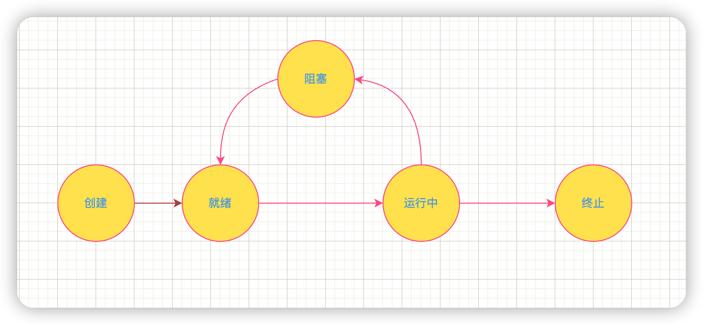

# 线程的生命周期以及状态转换

## 操作系统的线程生命周期

从操作系统的层面来说线程的状态划分为五种：**初始状态、就绪状态、运行状态、阻塞状态和终止状态**

### 初始状态

通过线程创建函数创建出来的新线程，在线程创建函数执行完后，将返回一个线程标识符供以后使用

### 就绪状态

操作系统中的线程被创建，可以分配CPU资源执行，但是还没有开始执行

### 运行状态

可运行状态的线程获得CPU资源以后，线程正在执行中，进入此状态

### 阻塞状态

指线程在执行中因某事件而受阻，处于暂停执行时的状态。**此时线程会释放CPU资源，阻塞状态的线程没有机会获得CPU的使用权。**

### 终止状态

线程执行完毕或者出现错误进入终止状态

## Java中的线程生命周期

参考[`JDK18中java.lang.Thread.State`](https://docs.oracle.com/en/java/javase/18/docs/api/java.base/java/lang/Thread.State.html)，Java线程的状态可以划分一下几种：[`NEW`](https://docs.oracle.com/en/java/javase/18/docs/api/java.base/java/lang/Thread.State.html#NEW)，[`RUNNABLE`](https://docs.oracle.com/en/java/javase/18/docs/api/java.base/java/lang/Thread.State.html#RUNNABLE)，[`BLOCKED`](https://docs.oracle.com/en/java/javase/18/docs/api/java.base/java/lang/Thread.State.html#BLOCKED)，[`WAITING`](https://docs.oracle.com/en/java/javase/18/docs/api/java.base/java/lang/Thread.State.html#WAITING)，[`TIMED_WAITING`](https://docs.oracle.com/en/java/javase/18/docs/api/java.base/java/lang/Thread.State.html#TIMED_WAITING)，[`TERMINATED`](https://docs.oracle.com/en/java/javase/18/docs/api/java.base/java/lang/Thread.State.html#TERMINATED)

### New（新建）

只是新创建出来的线程，还没有调用`start()`方法开始执行线程中的代码。

### RUNNABLE（可运行）

**这里的可运行状态(RUNNABLE)相当于操作系统线程状态中的就绪状态(READY)和运行状态(RUNNING)**

抢占式调度系统会分配给就绪状态的线程一个时间片来执行任务。当时间片用完时，操作系统会根据优先级选择其他线程运行。一个线程在系统层面上可能是等待运行，也可能是正在运行。但是这些状态对JVM来讲，都可以看做可运行状态。

### BLOCKED（阻塞）

该状态只与`synchronized`锁相关，`WAITING，TIMED_WAITING`状态下唤醒后因为需要竞争锁也会进入该状态

Java中的`BLOCKED`状态与操作系统中的阻塞状态不同，Java中的阻塞一定跟锁有关系。

> 从操作系统来说，线程因为调用阻塞API（如IO操作）会进入阻塞状态，在JVM下这个线程会是什么状态呢？不知道有没有大佬解释一下。
>
> 查询相关资料解释如下：
>
> 对JVM来说，等待CPU使用权（操作系统中线程处于可执行状态）和等待IO操作（操作系统中的线程处于休眠状态）没有区别，都是在等待某个资源，都被JVM认为是`RUNNABLE`状态。
>
> 所以是`RUNNABLE`状态？

### WAITING（等待）

一个线程正在无期限等待另一个线程执行一个特定的动作唤醒此线程，被唤醒的线程会进入`BLOCKED`状态，重新竞争锁。

### TIMED_WAITING（计时等待）

超时等待，让出CPU，不会无期限等待被其他线程唤醒。时间到了可以自动唤醒

### TERMINATED（终止）

线程已经终止，可能是正常终止，也可能是异常终止，一般可以终止的操作如下所示：

1. `run()`方法执行结束
2. 线程执行抛出异常终止
3. 对线程的实例调用`stop()`方法，现在该方法已经被废弃了。如果我们需要中断`run()`方法，可以调用`interrupt()`方法。

> **Java线程中的阻塞状态（BLOCKED）、无时限等待状态（WAITING）、有时限等待状态（TIMED_WAITING）都是一种状态，即通用线程生命周期中的休眠状态。也就是说，只要Java中的线程处于这三种状态时，那么，这个线程就没有CPU的使用权。**

## 状态的转换

### NEW到RUNNABLE状态

调用线程对象的`start()`方法

### RUNNABLE与BLOCKED的状态转换

`RUNNABLE`转换为`BLOCKED`只有一种可能：要进入synchronized修饰的方法、代码块，却因为获取不到锁标志，所以变成了阻塞。

### RUNNABLE与WAITING状态转换

1. 获得`synchronized`隐式锁的线程，调用无参的`Object.wait()`方法
2. 调用无参数的`Thread.join()`方法。例如，在线程A中调用线程B的`join()`方法，则线程A会等待线程B执行完以后再继续执行。而线程A在等待线程B执行的过程中，其状态会从`RUNNABLE`转换到`WAITING`。当线程B执行完毕，线程A的状态则会从`WAITING`状态转换成`RUNNABLE`状态。
3. 调用`LockSupport.park()`方法，当前线程会阻塞，线程的状态会从`RUNNABLE`转换成`WAITING`。调用`LockSupport.unpark(Thread thread)`可唤醒目标线程，目标线程的状态又会从`WAITING`状态转换到`RUNNABLE`。

### RUNNABLE与TIMED_WAITING状态转换

基本上都是调用带有超时参数的方法，如下所示：

1. 调用带超时参数的`Thread.sleep(long millis)`方法；
2. 获得synchronized隐式锁的线程，调用带超时参数的`Object.wait(long timeout)`参数；
3. 调用带超时参数的`Thread.join(long millis)`方法；
4. 调用带超时参数的`LockSupport.parkNanos(Object blocker, long deadline)`方法；
5. 调用带超时参数的`LockSuppor.parkUntil(long deadline)`方法

### RUNNABLE到TERMINATED状态

1. `run()`方法执行结束
2. 线程执行抛出异常终止
3. 对线程的实例调用`stop()`方法，现在该方法已经被废弃了。如果我们需要中断`run()`方法，可以调用`interrupt()`方法。