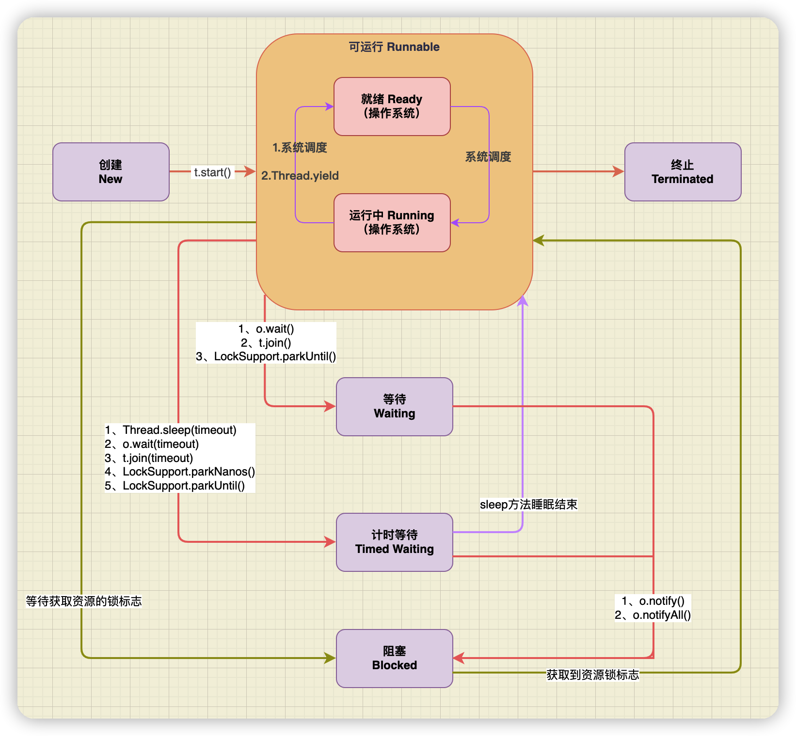

## Java线程的常用方法

Object类：`wait(), notify(), notifyAll()`

Thread类：`start(), sleep(), yield(), join()`

### wait()方法

使用同步对象调用此方法，使当前线程处于等待状态，直到其他线程调用同步对象的`notify()`方法或 `notifyAll()` 方法唤醒线程，或者超过设置的超时时间。

方法的两个参数：

+ timeout - 等待时间（以毫秒为单位）
+ nanos - 额外等待时间（以纳秒为单位）

方法有几个注意点：

1. 超时时间为`timeout`与`nanos`之和
2. `timeout`与`nanos`参数都为 0，则不会超时，等同于`wait()`
3. 调用方法前必须拥有对象的锁，否则会发生 **IllegalMonitorStateException** 异常
4. `wait()` 方法会释放对象的“锁标志”，失去CPU使用权
5. 调用`wait(),wait(0),wait(0,0)`方法后进入`WAITIN`状态
6. 有参方法调用后，此线程进入`TIMED_WAITING`状态

### notify()方法

使用同步对象调用此方法，从对象等待池中随机选一个线程移出并放入锁标志等待池中，只有锁标志等待池中的线程可以获取锁标志，在当前线程放弃对该对象的锁定之前，被唤醒的线程将无法继续，它们随时准备争夺锁的拥有权。

1. 调用方法前必须拥有对象的锁，否则会发生 **IllegalMonitorStateException** 异常
2. 被唤醒的线程进入BLOCKED 状态，重新竞争锁

### notifyAll()方法

使用同步对象调用此方法，唤醒对象等待池中所有的等待线程，让他们加入锁标志等待池中竞争锁。

1. 调用方法前必须拥有对象的锁，否则会发生 **IllegalMonitorStateException** 异常
2. 被唤醒的线程进入BLOCKED 状态，重新竞争锁

> `wait()`，`notify()` 及 `notifyAll()` 只能在 `synchronized` 语句中使用，但是如果使用的是 `ReenTrantLock` 实现同步，该如何达到这三个方法的效果呢？解决方法是使用 `ReenTrantLock.newCondition()` 获取一个 `Condition` 类对象，然后 `Condition` 的 `await()`，`signal()` 以及 `signalAll()` 分别对应上面的三个方法。

### start()方法

启动线程，使用线程的实例调用此方法，JVM会调用此线程的run方法。

1. 调用方法后进入`RUNNABLE`状态，失去CPU使用权
2. 不能多次启动同一线程实例；线程一旦结束，也不能重新启动。两者都会抛出 `java.lang.IllegalThreadStateException` 异常

### sleep(long millis)方法

JDK18 描述如下所示：

> Causes the currently executing thread to sleep (temporarily cease execution) for the specified number of milliseconds, subject to the precision and accuracy of system timers and schedulers. The thread does not lose ownership of any monitors.
>
> 使当前执行的线程在指定的毫秒数内休眠（暂时停止执行），这取决于系统计时器和调度程序的精度和准确性。线程不会失去任何监视器的所有权。

1. 这个方法需要传入参数，表示线程睡眠指定的时间
2. 调用方法后进入`TIMED_WAITING`状态，失去CPU使用权
3. 不会释放“锁标志”，如果有 `synchronized` 同步块，其他线程仍然不能访问共享数据
4. 时间到了以后自动唤醒进入`RUNNABLE`状态

### yield()方法

JDK18 描述如下所示：

> A hint to the scheduler that the current thread is willing to yield its current use of a processor. The scheduler is free to ignore this hint.
>
> Yield is a heuristic attempt to improve relative progression between threads that would otherwise over-utilise a CPU. Its use should be combined with detailed profiling and benchmarking to ensure that it actually has the desired effect.
>
> It is rarely appropriate to use this method. It may be useful for debugging or testing purposes, where it may help to reproduce bugs due to race conditions. It may also be useful when designing concurrency control constructs such as the ones in the [`java.util.concurrent.locks`](https://docs.oracle.com/en/java/javase/14/docs/api/java.base/java/util/concurrent/locks/package-summary.html) package.

此方法是一种尝试改变操作系统的线程调度的方法，调用此方法只是使当前线程重新回到可执行状态，该线程改变状态后可能会被马上执行。

1. 调用方法后进入操作系统层面的就绪状态
2. 不会释放“锁标志”
3. `yield()` 方法只能使同优先级或者高优先级的线程得到执行机会

### join()方法

JDK18 描述如下所示：

> Waits at most `millis` milliseconds for this thread to die. A timeout of `0` means to wait forever.
>
> This implementation uses a loop of `this.wait` calls conditioned on `this.isAlive`. As a thread terminates the `this.notifyAll` method is invoked. It is recommended that applications not use `wait`, `notify`, or `notifyAll` on `Thread` instances.

A线程中调用B线程的join()方法，则A线程会等待B线程结束以后在继续执行。从源码实现以及jdk文档描述我们可以看出`join`是基于`wait`方法实现。

1. 这个方法可以传入参数，参数为`0`时相当于无参调用
2. `join()`和`join(0)`相等，都是永远等待，调用方法后进入`WAITIN`状态
3. 有参方法调用后，此线程进入`TIMED_WAITING`状态
4. 会释放“锁标志”
5. 对已经运行结束的线程调用`join()`方法会立刻返回

### 调用方法线程状态变化图
