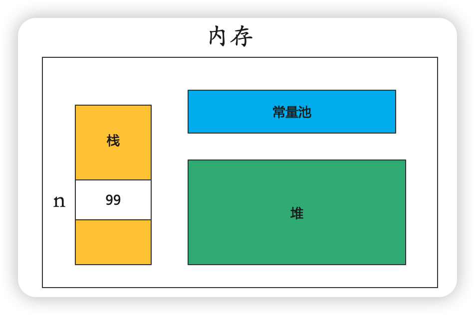

# 常量和变量

## 标识符

+ 标识符可以由字母、数字、下划线`(_)`和美元符`($)`组成，不能以数字开头
+ 标识符严格区分大小写
+ 标识符不能是Java关键字和保留字
+ 标识符的命名最好能反应其作用

## 关键字

`abstract,boolean,break,byte,case,catch,char,class,continue,default,do,double,else,extends,false,final,finally,float,for,if,implements,import,native,int,interface,long,instanceof,new,null,package,private,protected,public,return,short,static,super,switch,synchronized,this,throw,throws,transient,true,try,void,volatile,while`

## 数据类型

数据类型分为基础数据类型和引用数据类型，引用数据类型包含数组和类。类定义的变量叫做对象。

### 基础数据类型

| 数据类型 | 说明         | 字节长度 |
| -------- | ------------ | -------- |
| byte     | 字节型       | 1        |
| short    | 短整型       | 2        |
| int      | 整型         | 4        |
| long     | 长整型       | 8        |
| float    | 单精度浮点型 | 4        |
| double   | 双精度浮点型 | 8        |
| char     | 字符型       | 2        |
| boolean  | 布尔型       | 1        |

+ 整型默认情况下是`int`类型，如果表示`long`整型，通常在数值后面加`l`或`L`，例如`100L`
+ 浮点型默认情况下是`double`类型，如果表示`float`类型，则需要在数值后面加`f`或`F`
+ 字符型的值是用单引号引起来的的一个字符，例如 `'a'、'b'`
+ 布尔类型只能定义为`true`和`false`，例如`boolean a = true`

> 字符串不是基础数据类型，它是类。字符串通常是由双引号引起来的0个或多个字符组成。
>
> 例如`String str = ""`

## 进制表示

+ 十进制：无开头标识，包含`0 - 9`的数字，例如 `37,34`
+ 八进制：以`0`开头，包含`0 - 7`的数字，例如 `037,034`
+ 十六进制：以`0x`或`0X开头，包含数字`0 - 9`，及字母`a - f,A - F`（a表示数字10，以此类推）

## 变量

+ 变量的三个元素：变量类型、变量名和变量值。
+ 按照作用范围分为：类级、对象实现、方法级（局部变量）、块级

**示例**

```
变量类型  ---> 房间类型（单人间、双人间）
变量名    ---> 房间名字
变量类型  ---> 入住的客人
```

### 命名规则

+ 满足标识符的命名规则
+ 满足驼峰法命名
+ 尽量简单，做到见名知意
+ 变量名的长度没有限制

### 声明与赋值

+ 变量声明也叫做定义变量，格式：`数据类型 变量名`

**示例**

```java
int n; // 声明整型变量n
long count; //声明长整型变量count
```

+ 赋值使用“=”运算符，将运算符右边的值赋给左边的变量

**示例**

```java
int n; // 定义int型变量n
n = 99; // 将99赋值给n
```

+ 我们也可以在声明变量的时候直接给变量赋值，这也是变量的初始化

```java
int n = 99; // int型变量存放十进制数据
char a = 'a'; // 定义并初始化字符型变量a
char c = 66; // 表示字母B，ASCII码表示字符
char d = '\u0041'; //表示字母A，Unicode编码
```

### 基础数据类型变量的存储

+ `int n = 99`




