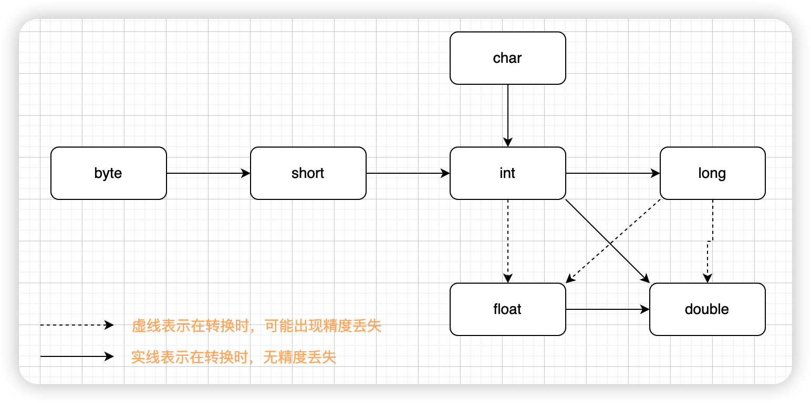

# 类型转换

## 自动类型转换

自动类型转换又被称为隐式类型转换，通常是表示范围小的类型往数值范围大的类型转换

**示例代码**

```java
long n = 123; // int类型数据转化成long类型
```

自动类型转换顺序如下所示



**示例代码**

```java
float num = 1012345678901L;
System.out.println(num); // 输出 1.01234567E12
```

## 强制类型转换

表示范围大的类型往数值范围小的类型转换。例如`long`类型转化为`int`类型。转换时，需要在值的前面加上要转换的类型，格式：`(要转换的类型)值`

强制类型转换容易出现精度丢失，数据溢出等问题。

**示例代码**

```java
int num = (int) 123456789L;
```