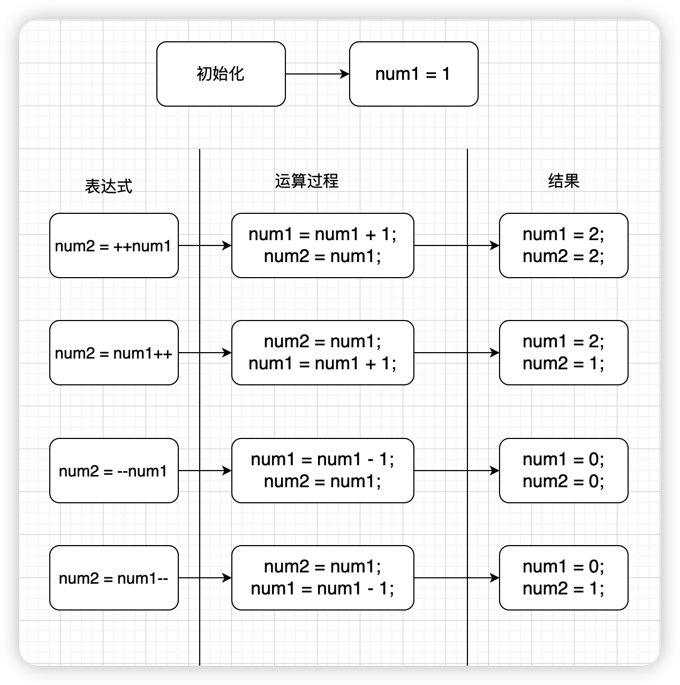

# 运算符

表达式通常由**运算符**和**操作数**组成，当运算符需要两个操作数时，成为双目运算符。当运算符需要一个操作数时，成为单目运算符。

**示例代码**

```java
1 // 一个数字
num // 一个变量
num1 + num2
sum = num1 + num2
```

## 常见的算术运算符

| 算术运算符 | 名称  | 示例             |
| ---------- | ----- | ---------------- |
| +          | 加法  | `1 + 2 = 3`      |
| -          | 减法  | `3 - 2 = 1`      |
| *          | 乘法  | `2 * 3 = 6`      |
| /          | 除法  | `4 / 2 = 2`      |
| %          | 求余  | `9 % 4 = 1`      |
| ++         | 自增1 | `int a = 2; a++` |
| --         | 自减1 | `int a = 2; a--` |

+ 当使用`+`时，如果表达式中存在字符串，则**从遇到字符串开始，后面的运算变成字符串的拼接**
+ 数字与字符进行`+-*/%`运算时，字符会转成ASCII码的值，再进行加法运算

**示例代码**

```java
int b = 2;
int c = 3;
int d = 4;
System.out.println('a' % b); // 输出 1
System.out.println(b + c + 'a' + d); // 输出 106
System.out.println(b + c + "" + d); // 输出 54
System.out.println(9 / 2); // 输出 4 ，当被除数和除数都是整型时，结果为整除后的值
System.out.println(9.0 / 2); // 输出 4.5，当被除数和除数有一个包含小数时，结果会包含小数
```

### 自增自减运算符

运算过程如下所示



## 赋值运算符

赋值运算符`(=)`是**从右往左**运算的，格式：`变量 = 表达式`

**示例代码**

```java
// 把100赋值给变量num
int num = 100
```

## 复合赋值运算符

假设`a = 9`，运算结果如下表所示

| 运算符 | 表达式   | 等效表达式  | 结果 |
| ------ | -------- | ----------- | ---- |
| +=     | `a += 3` | `a = a + 3` | 12   |
| -=     | `a -= 3` | `a = a - 3` | 6    |
| *=     | `a *= 3` | `a = a * 3` | 27   |
| /=     | `a /= 3` | `a = a / 3` | 3    |
| %=     | `a %= 3` | `a = a % 3` | 0    |

## 关系运算符

关系运算符主要用于比较两个数之间的关系，比如大于、小于、不等于。比较的结果是一个布尔值。**运算符必须是英文输入法状态下输入**

**常见运算符**

| 运算符 | 名称     | 表达式 | 结果  |
| ------ | -------- | ------ | ----- |
| `>`    | 大于     | 9 > 4  | true  |
| `>=`   | 大于等于 | 9 >= 4 | true  |
| `<`    | 小于     | 9 < 4  | false |
| `<=`   | 小于等于 | 9 <= 4 | false |
| `==`   | 等于     | 9 == 4 | false |
| `!=`   | 不等于   | 9 != 4 | true  |

+ 如果出现两个字符之间比较大小，则比较的是两个字符的ASCII码

```java
'A' > 'B' // 结果为false
```

+ 浮点数与整数之间的比较，只要值相等就为 true

```java
float a = 3.0f;
long b = 3L;
f == l; // 结果为true
```

## 条件结构

条件结构是指根据不同的条件去执行不同的操作。关系运算符主要用于这里面的判断条件。

### `if`语句结构

```java
// 如果条件为true，则执行代码块，否则跳过代码块
if (条件) {
    代码块
}
```

**示例代码**

```java
int result = 88;
// 如果分数大于60分，则通过考试
if (result >= 60) {
    System.out.println("通过考试");
}
```

### `if-else`结构

```java
// 如果条件为true，则执行代码块1，否则执行代码块2
if (条件) {
    代码块1
} else {
	代码块2
}
```

**示例代码**

```java
int result = 88;
// 如果分数大于60分，则通过考试
if (result >= 60) {
    System.out.println("通过考试");
} else {
    System.out.println("需要补考");
}
```

## 逻辑运算符

逻辑运算符的操作数都是**布尔型**

| 运算符    | 名称 | 表达式                   |
| --------- | ---- | ------------------------ |
| `&&`或`&` | 与   | operator1 && operator2   |
| `||`或`|` | 或   | operator1 \|\| operator2 |
| `!`       | 非   | !operator                |

**示例代码**

```java
// && 运算符，如果第一个表达式的值能决定表达式最终的结果，则运算符右边的表达式不再计算了
int a = 1;
boolean result1 = (1 > 2) && ((a++) < 2);
System.out.println(result1); // false
System.out.println(a); // 1

// & 运算符，两边的表达式都需要计算
int b = 1;
boolean result2 = (1 > 2) & ((b++) < 2);
System.out.println(result2); // false
System.out.println(b); // 1

// | 运算符，两边的表达式都需要计算
int c = 1;
boolean result3 = (1 < 2) | ((c++) < 2);
System.out.println(result3); // true
System.out.println(c); // c=2

// || 运算符，如果第一个表达式的值能决定表达式最终的结果，则运算符右边的表达式不再计算了
int d = 1;
boolean result4 = (1 < 2) || ((d++) < 2);
System.out.println(result4); // true
System.out.println(d); // 1
```

### &&、||  和  &、|  的区别

`&&、||`运算符又叫短路运算符，如果第一个表达式的值能决定表达式最终的结果，则运算符右边的表达式不再计算了。

`&、|`运算符则是两边的表达式都需要计算

### ! 运算符

对原条件取反

```java
int a = 1;
int b = 2;
!(a < b) // 值为false
```

## 条件运算符

Java中的条件运算符为三目运算符，格式：`布尔表达式 ? 表达式1 : 表达式2`

当布尔表达式的值为true时，则返回表达式1的值，否则返回表达式2的值

**示例代码**

```java
boolean boo = true;
System.out.println(boo ? 3 : 5); // 输出 3
```

## 运算符的优先级

自上往下为优先级按照从高往低排序

| 运算符             | 描述                           |
| ------------------ | ------------------------------ |
| `()`               | 圆括号                         |
| `!,~,++,--`        | 逻辑非，按位非，自增，自减     |
| `*,/,%`            | 乘法，除法，取余               |
| `+,-`              | 加法，减法                     |
| `>>,<<`            | 按位右移，按位左移             |
| `<,<=,>,>=`        | 小于，小于等于，大于，大于等于 |
| `==,!=`            | 等于，不等于                   |
| `&`                | 按位与                         |
| `^`                | 按位异或                       |
| <code>|</code>     | 按位或                         |
| `&&`               | 逻辑与                         |
| <code>||</code>    | 逻辑或                         |
| `?:`               | 条件分支                       |
| `=,+=,*=,/=,%/,-=` | 赋值，复合赋值运算符           |

