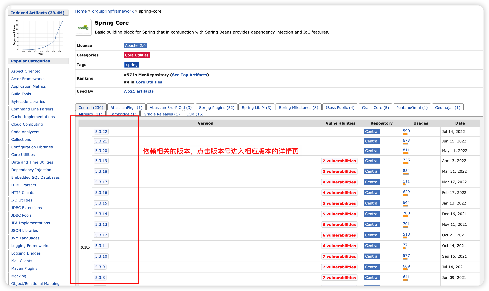

# 什么是 Maven

目前无论使用 IDEA 还是 Eclipse 等其他 IDE，使用里面 ANT 工具帮助我们进行编译，打包运行等工作。Apache 基于 ANT 进行了升级，研发出了全新的自动化构建工具 Maven。

Maven 使用项目对象模型（POM-Project Object Model，项目对象模型）的概念，可以通过一小段描述信息来管理项目的构建，报告和文档的软件项目管理工具。在 Maven 中每个项目都相当于是一个对象，对象（项目）和对象（项目）之间是有关系的。关系包含了：依赖、继承、聚合，实现 Maven 项目可以更加方便的实现导 jar 包、拆分项目等效果。

下载地址：<https://maven.apache.org/download.cgi>


## 目录结构


- `bin`：存放的是执行文件，命令
- `conf`：存放配置文件，里面的`settings.xml`是 maven 的全局配置文件。

在 IDEA 中直接集成了 Maven，`setting`配置存放在`.m2`目录下，如果没有该目录可以手动执行一下 maven 命令：`mvn help:system`

## 远程仓库和本地仓库

远程仓库指通过各种协议（如`file://`和`http://`）访问的其它类型的仓库。不在本机中的一切仓库，都是远程仓库。远程仓库又分为**中央仓库**和**本地私服仓库**。

远程仓库可能是第三方搭建的真实的远程仓库，用来提供他们的构件下载（例如`repo.maven.apache.org`和`uk.maven.org`是 Maven 的中央仓库）。

远程仓库也可以是公司自己在局域网搭建的 Maven 仓库，用来在开发团队间共享私有构件和管理发布的。

默认的远程仓库使用的 Apache 提供的中央仓库：<https://mvnrepository.com/>

本地仓库指本机的一份拷贝，用来缓存远程下载，包含你尚未发布的临时构件。





## 仓库配置

在`settings.xml`中：主要配置了三个信息：

1. 本地仓库地址
2. 镜像仓库信息
3. 指定 JDK 的版本

### 配置本地仓库

本地仓库是开发者本地电脑中的一个目录，用于缓存从远程仓库下载的构件。默认的本地仓库是`${user.home}/.m2/repository`。用户可使用`settings.xml`文件修改本地仓库。具体内容如下：

```xml
<?xml version="1.0" encoding="UTF-8"?>
<settings xmlns="http://maven.apache.org/SETTINGS/1.0.0"
          xmlns:xsi="http://www.w3.org/2001/XMLSchema-instance"
          xsi:schemaLocation="http://maven.apache.org/SETTINGS/1.0.0 http://maven.apache.org/xsd/settings-1.0.0.xsd">
  <!-- 本地仓库配置 -->
  <localRepository>具体本地仓库位置</localRepository>
  <!-- 省略，具体信息参考后续内容。 -->
</settings>
```

### 配置镜像仓库

如果仓库 A 可以提供仓库 B 存储的所有内容，那么就可以认为 A 是 B 的一个镜像。例如：我们可以使用阿里云提供的镜像替换官方镜像，提高下载依赖的速度。打开 maven 的配置文件（ windows 机器一般在 maven 安装目录的 **conf/settings.xml** ），在`<mirrors></mirrors>`标签中添加`mirror`子节点:

```xml
<mirror>
  <!-- 指定镜像ID（可自己改名） -->
  <id>aliyunmaven</id>
  <!-- 匹配中央仓库（阿里云的仓库名称，不可以自己起名，必须这么写）-->
  <mirrorOf>*</mirrorOf>
  <!-- 指定镜像名称（可自己改名）  -->
  <name>阿里云公共仓库</name>
  <!-- 指定镜像路径（镜像地址） -->
  <url>https://maven.aliyun.com/repository/public</url>
</mirror>
```

### 仓库优先级


### JDK 配置

当你的本地环境中有多个`jdk`的时候，就需要指定你编译和运行的`jdk`。在`settings.xml中`配置：

```xml
<profile>
    <!-- settings.xml中的id不能随便起的 -->
    <!-- 告诉maven我们用jdk1.8 -->
    <id>jdk-1.8</id>
    <!-- 开启JDK的使用 -->
    <activation>
        <activeByDefault>true</activeByDefault>
        <jdk>1.8</jdk>
    </activation>
    <properties>
        <!-- 配置编译器信息 -->
        <maven.compiler.source>1.8</maven.compiler.source>
        <maven.compiler.target>1.8</maven.compiler.target>
        <maven.compiler.compilerVersion>1.8</maven.compiler.compilerVersion>
    </properties>
</profile>
```

**配置的前提是环境中一定要有对应版本的 jdk，不然使用的时候会报错**

## Maven 工程类型

**1、POM 工程** POM 工程是逻辑工程。用在父级工程或聚合工程中。用来做 jar 包的版本控制。

**2、JAR 工程** 将会打包成 jar，用作 jar 包使用。即常见的本地工程 ---> Java Project。

**3、WAR 工程** 将会打包成 war，发布在服务器上的工程。

## Maven 项目结构

```
--MavenDemo 项目名
  --.idea 项目的配置，自动生成的，无需关注。
  --src
    -- main 实际开发内容
         --java 写包和java代码，此文件默认只编译.java文件
         --resource 所有配置文件。最终编译把配置文件放入到classpath中。
    -- test  测试时使用，自己写测试类或junit工具等
        --java 储存测试用的类
  pom.xml 整个maven项目所有配置内容。
```

- `src/main/java` 储存 java 源代码
- `src/main/resources`储存主要的资源文件。比如 xml 配置文件和 properties 文件
- `src/test/java`储存测试用的类，比如 JUNIT 的测试一般就放在这个目录下面。因为测试类本身实际是不属于项目的，所以放在任何一个包下都显得很尴尬，所以 maven 专门创建了一个测试包用于存放测试的类
- `src/test/resources`储存测试环境用的资源文件
- `src`包含了项目所有的源代码和资源文件，以及其他项目相关的文件。
- `target`编译后内容放置的文件夹
- `pom.xml`是 Maven 的基础配置文件。配置项目和项目之间关系，包括配置依赖关系等等

注意：目录名字不可以随便改，因为 maven 进行编译或者 jar 包生成操作的时候，是根据这个目录结构来找的，你若轻易动，那么可能会找不到了。
