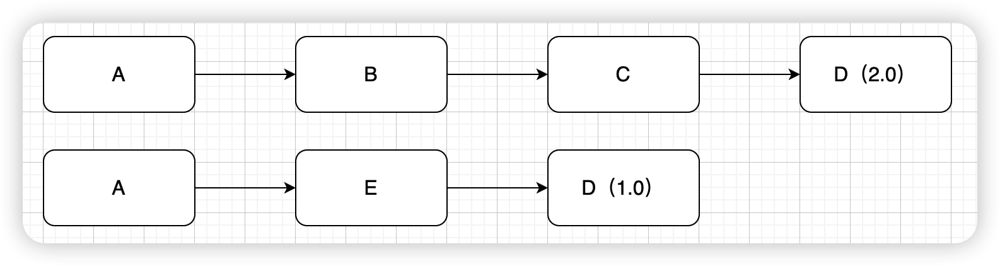

# POM文件

## 传递依赖

传递性依赖是Maven2.0的新特性。假设你的项目依赖于一个库，而这个库又依赖于其他库。你不必自己去找出所有这些依赖，你只需要加上你直接依赖的库，Maven会隐式的把这些库间接依赖的库也加入到你的项目中。这个特性是靠解析从远程仓库中获取的依赖库的项目文件实现的。一般的，这些项目的所有依赖都会加入到项目中，或者从父项目继承，或者通过传递性依赖。

如果A依赖了B，那么C依赖A时会自动把A和B都导入进来。


创建A项目后，选择IDEA最右侧Maven面板`lifecycle`，双击`install`后就会把项目安装到本地仓库中，其他项目就可以通过坐标引用此项目。


## 两个原则

### 第一原则：最短路径优先原则

“最短路径优先”意味着项目依赖关系树中路径最短的版本会被使用。

例如，假设A、B、C之间的依赖关系是`A->B->C->D(2.0) ` 和`A->E->(D1.0)`，那么`D(1.0)`会被使用，因为A通过E到D的路径更短。



### 第二原则：最先声明原则

依赖路径长度是一样的的时候，第一原则不能解决所有问题，比如这样的依赖关系：`A–>B–>D(1.0)`，`A–>C–>D(2.0)`，`D(1.0)`和`D(2.0)`的依赖路径长度是一样的。那么到底谁会被解析使用呢？

在`maven2.0.8`及之前的版本中，这是不确定的，但是`maven2.0.9`开始，为了尽可能避免构建的不确定性，maven定义了依赖调解的第二原则：第一声明者优先。在依赖路径长度相等的前提下，在POM中依赖声明的顺序决定了谁会被解析使用。**顺序最靠前的那个依赖优胜**。


## 排除依赖

`exclusions`： 用来排除传递性依赖 其中可配置多个`exclusion`标签，每个`exclusion`标签里面对应的有`groupId, artifactId, version`三项基本元素。**可以不用写版本号**。

```xml
<dependency>
    <groupId>org.springframework</groupId>
    <artifactId>spring-beans</artifactId>
    <version>5.3.14</version>
    <exclusions>
        <!--排除spring-beans中的mybatis依赖-->
        <exclusion>
            <groupId>org.mybatis</groupId>
            <artifactId>mybatis</artifactId>
        </exclusion>
    </exclusions>
</dependency>
```

## 依赖范围

依赖范围（`<scope></scope>`标签）决定了你依赖的坐标在什么情况下有效，什么情况下无效

| 依赖范围 | 编译有效 | 测试有效 | 运行有效 | 示例                     |
| -------- | -------- | -------- | -------- | ------------------------ |
| compile  | Y        | Y        | Y        | spring-core              |
| test     | N        | Y        | N        | Junit                    |
| provided | Y        | Y        | N        | Servlet-api              |
| runtime  | N        | Y        | Y        | JDBC驱动                 |
| system   | Y        | Y        | N        | 本地Maven仓库之外的jar包 |

### compile

这是默认范围。如果没有指定，就会使用该依赖范围。表示该依赖**在编译和运行时都生效**

```xml
<dependency>
    <groupId>commons-beanutils</groupId>
    <artifactId>commons-beanutils</artifactId>
    <version>1.9.4</version>
    <scope>compile</scope>
</dependency>
```

### provided

Maven依赖的范围，打包以后不再需要。典型的例子是servlet-api，编译和测试项目的时候需要该依赖，但在运行项目的时候，由于容器已经提供，就不需要Maven重复地引入一遍

```xml
<dependency>
    <groupId>javax.servlet</groupId>
    <artifactId>servlet-api</artifactId>
    <version>3.0-alpha-1</version>
    <scope>provided</scope>
</dependency>
```

### runtime

runtime范围表明编译时不需要生效，而**只在运行时生效**。典型的例子是JDBC驱动实现，项目主代码的编译只需要JDK提供的JDBC接口，只有在执行测试或者运行项目的时候才需要实现上述接口的具体JDBC驱动。

### system

系统范围与provided类似，不过你必须显式指定一个本地系统路径的JAR，此类依赖应该一直有效，Maven也不会去仓库中寻找它。但是，使用`system`范围依赖时必须通过`systemPath`元素显式地指定依赖文件的路径。

```xml
<dependency>
    <!--自定义-->
    <groupId>com.calos</groupId> 
    <!--自定义-->
    <artifactId>sdk</artifactId>   
    <!--自定义-->
    <version>1.0</version>
    <!--system，类似provided，需要显式提供依赖的jar以后，Maven就不会在Repository中查找它-->
    <scope>system</scope>
    <!--项目根目录下的lib文件夹下-->
    <systemPath>${basedir}/lib/sdk-1.0.jar</systemPath>
</dependency>
```

### test

test范围表明使用此依赖范围的依赖，只在编译测试代码和运行测试的时候需要，应用的正常运行不需要此类依赖。典型的例子就是Junit，它只有在编译测试代码及运行测试的时候才需要。Junit的jar包就在测试阶段用就行了，你导出项目的时候没有必要把junit的东西带出来了。

```xml
<dependency>
  <groupId>junit</groupId>
  <artifactId>junit</artifactId>
  <version>4.12</version>
  <scope>test</scope>
</dependency>
```

### Import

import范围只适用于pom文件中的`<dependencyManagement>`部分。表明指定的POM必须使用`<dependencyManagement>`部分的依赖。
注意：`import`只能用在`dependencyManagement`的scope里。

```xml
<dependencyManagement>           
  <dependency>
    <groupId>org.springframework.cloud</groupId>
    <artifactId>spring-cloud-dependencies</artifactId>
    <version>${spring.cloud.version}</version>
    <type>pom</type>
    <scope>import</scope>
  </dependency>
</dependencyManagement>
```

## 继承

如果A工程继承B工程，则代表A工程默认依赖B工程依赖的所有资源，且可以应用B工程中定义的所有资源信息。被继承的工程（B工程）只能是POM工程。

注意：在父项目中放在`<dependencyManagement>`中的内容不被子项目继承，不可以直接使用。放在`<dependencyManagement>`中的内容主要目的是进行版本管理。里面的内容在子项目中依赖时坐标只需要填写`<groupId>`和`<artifactId>`即可。（注意：**如果子项目不希望使用父项目的版本，可以明确配置version**）。

这个本质上是POM文件的继承 。

在父目录的pom文件定义版本：

```xml
<dependencyManagement>             
  <dependency>
    <groupId>commons-dbutils</groupId>
    <artifactId>commons-dbutils</artifactId>
    <version>1.7</version>
  </dependency>
</dependencyManagement>
```

在子项目中使用此依赖时，不再需要指定版本号

```xml
<dependencies>
  <dependency>
    <groupId>commons-dbutils</groupId>
    <artifactId>commons-dbutils</artifactId>
  </dependency>
</dependencies>
```

## 聚合

当我们开发的工程拥有2个以上模块的时候，每个模块都是一个独立的功能集合。比如商城系统中拥有用户管理，商品管理，通知系统等。开发的时候每个平台都可以独立编译，测试，运行。这个时候我们就需要一个聚合工程。

在创建聚合工程的过程中，总的工程必须是一个POM工程（Maven Project）（聚合项目必须是一个pom类型的项目，jar项目war项目是没有办法做聚合工程的），各子模块可以是任意类型模块（Maven Module）。

聚合时多个项目的本质还是一个项目。这些项目被一个大的父项目包含。且这时父项目类型为pom类型。同时在父项目的pom.xml中出现`<modules>`表示包含的所有子模块。

聚合的前提是继承，它包含了继承的特性。

例如在common工程中引入`service-base,common-utils,spring-security`等子工程。

```xml
<?xml version="1.0" encoding="UTF-8"?>
<project xmlns="http://maven.apache.org/POM/4.0.0"
         xmlns:xsi="http://www.w3.org/2001/XMLSchema-instance"
         xsi:schemaLocation="http://maven.apache.org/POM/4.0.0 http://maven.apache.org/xsd/maven-4.0.0.xsd">
    <parent>
        <artifactId>sgbc-parent</artifactId>
        <groupId>com.sgbc</groupId>
        <version>0.0.1-SNAPSHOT</version>
    </parent>
    <modelVersion>4.0.0</modelVersion>

    <artifactId>common</artifactId>
    <packaging>pom</packaging>
    <modules>
        <module>service-base</module>
        <module>common-utils</module>
        <module>spring-security</module>
    </modules>

    <properties>
        <maven.compiler.source>8</maven.compiler.source>
        <maven.compiler.target>8</maven.compiler.target>
    </properties>

    <dependencies>
      ......
    </dependencies>
</project>
```

