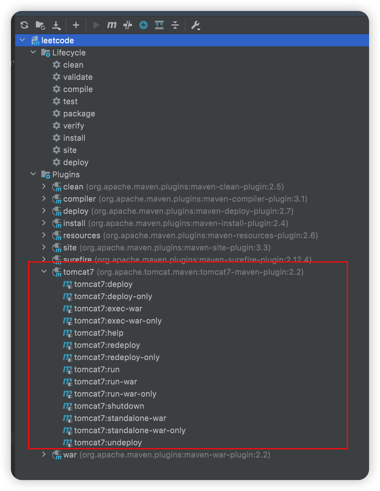

# Maven插件

## 编译器插件

通过编译器插件，我们可以配置使用的JDK或者说编译器的版本：

### settings.xml文件中配置全局编译器插件

找到profiles节点，在里面加入profile节点：

```xml
<profile>
    <!-- 定义的编译器插件ID，全局唯一，名字随便起 -->
    <id>jdk-1.7</id>
    <!-- 插件标记，activeByDefault ：true默认编译器，jdk提供编译器版本 -->
    <activation>
        <activeByDefault>true</activeByDefault>
        <jdk>1.7</jdk>
    </activation>
    <!-- 配置信息source-源信息，target-字节码信息，compilerVersion-编译过程版本 -->
    <properties>
        <maven.compiler.source>1.7</maven.compiler.source>
        <maven.compiler.target>1.7</maven.compiler.target>
        <maven.compiler.compilerVersion>1.7</maven.compiler.compilerVersion>
    </properties>
</profile>
```

### 配置编译器插件：pom.xml配置片段

```xml
<!-- 配置maven的编译插件 --> 
<build>
    <plugins>
        <!--JDK编译插件 -->
        <plugin>
            <!--插件坐标 -->
            <groupId>org.apache.maven.plugins</groupId>
            <artifactId>maven-compiler-plugin</artifactId>
            <version>3.2</version>
            <!-- -->
            <configuration>
                <!-- 源代码使用JDK版本-->
                <source>1.7</source>
                <!-- 源代码编译为class文件的版本，要保持跟上面版本一致-->
                <target>1.7</target>
                <encoding>UTF-8</encoding>
            </configuration>
        </plugin>
    </plugins>
</build>
```

## 资源拷贝插件

Maven在打包时默认只将src/main/resources里的配置文件拷贝到项目中并做打包处理，而非resource目录下的配置文件在打包时不会添加到项目中。

我们的配置文件，一般都放在：`src/main/resources` ，然后打包后配置文件就会在target的classes下面放着

现在把非resources下面的文件也打包到classes下面，在需要下面的配置

**pom.xml配置片段**

```xml
<build>
    <resources>
        <resource>
            <directory>src/main/java</directory>
            <includes>
                <include>**/*.xml</include>
            </includes>
        </resource>
        <resource>
            <directory>src/main/resources</directory>
            <includes>
                <include>**/*.xml</include>
                <include>**/*.properties</include>
            </includes>
        </resource>
    </resources>
</build>
```

## tomcat插件

我们如果创建war项目，必然要部署在服务器上，假如我们不再依赖外部的tomcat，使用使用maven提供的tomcat插件是不是也能运行呢？

具体pom.xml文件的配置如下：

```xml
<build>
    <plugins>
      <!-- 配置Tomcat插件 -->
      <plugin>
        <groupId>org.apache.tomcat.maven</groupId>
        <artifactId>tomcat7-maven-plugin</artifactId>
        <version>2.2</version>
        <configuration>
     <!-- 配置Tomcat监听端口 -->
          <port>8080</port>
     <!-- 配置项目的访问路径(Application Context) -->
          <path>/</path>
        </configuration>
      </plugin>
    </plugins>
</build>
```

使用Tomcat插件发布部署并执行war工程的时候，需要使用启动命令，启动命令为： `tomcat7:run`。命令中的tomcat7是插件命名，由插件提供商决定。run为插件中的具体功能。

tomcat属于可运行插件，它什么时候工作需要程序员来控制，所以我们必须通过命令来运行控制



