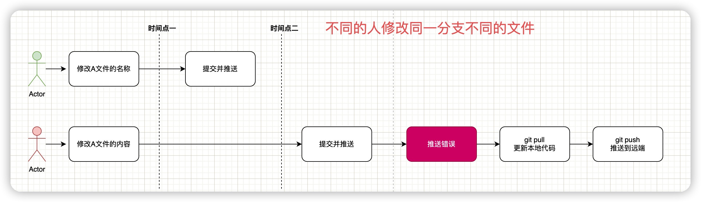
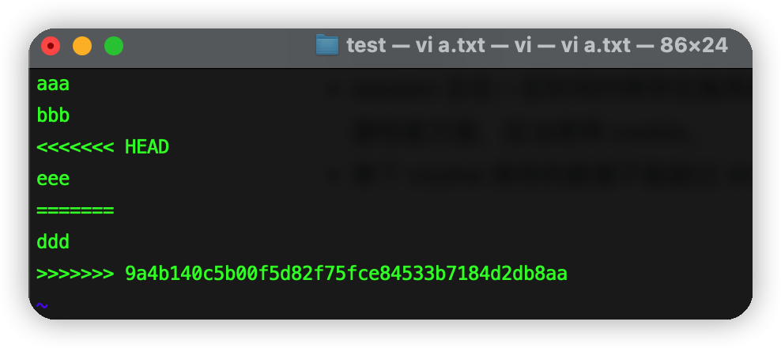
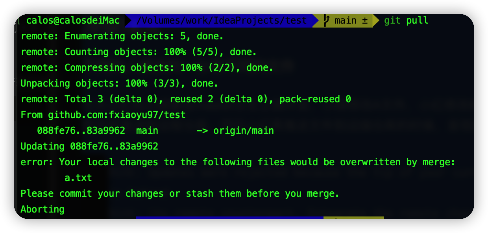

# git推送代码遇到冲突时该怎么办

## 背景

多人使用**同一个远端仓库同一分支**上开发项目，这时候直接推送代码到远端仓库，然后就会出现一系列的文件修改冲突情况，接下来我们具体情况具体分析一下。

> **背景提要：同一远端仓库的同一分支**

## 一、不同的人修改不同的文件

今天小红和小绿都在master分支上做开发，小绿修改A文件，小红修改B文件。小绿先把文件推送到远程仓库。然后小红再推送文件到远端仓库的时候，发现推送出错了。

```
hint: Updates were rejected because the tip of your current branch is behind
hint: its remote counterpart. Integrate the remote changes (e.g.
hint: 'git pull ...') before pushing again.
hint: See the 'Note about fast-forwards' in 'git push --help' for details.
```

不要慌，只要更新一下本地代码（`git pull`）再推送一下即可。

**操作流程图**



## 二、不同的人修改同一的文件的不同区域

今天小红和小绿都在master分支上做开发，这次他们修改的是同一个文件，小绿修改文件的第一段代码，小红修改文件的第二段代码。小绿先把文件推送到远程仓库。然后小红再推送文件到远端仓库的时候，发现推送出错了。这时候该怎么办呢？

不要慌，这都是个小场面。虽然修改的是同一个文件，但是没有涉及到同一个区域，Git还是可以自动处理这种情况的。所以还是按照之前的方法，在提交之前，更新一下本地代码。


>  以上两种情况也是我们开发过程中最常见的情况，除了推送报错的时候我们这么干，那么我们是不是还有优雅的方法呢？
>
> 还是有的，就是在提交本地代码前，先更新一下本地代码，然后再提交推送。
>
> 
>
> 如果是先提交，再更新，最后推送到远端，提交记录中会多一条合并代码的记录，所有在意这条记录的同学就千万不要搞错顺序了。
>
> 

## 三、不同的人修改同一的文件的同一区域

今天小红和小绿都在master分支上做开发，这次他们修改的是同一个文件的同一区域，先提交的小绿还是很吃香的，后提交的小红还是冲突了，这时候该怎么办呢？

首先小红要更新代码`(git pull)`，然后发现有冲突的提示，但是 Git 还是做了自动合并，但是它把两次修改的内容都保留在文件中，由用户处理决定如何文件内容。



这时候冲突文件的状态会发生改变，变成未添加的状态，所以改变以后小红需要重新添加提交冲突的文件，但是会多一次处理冲突的提交记录。


那是否有办法减少这次提交记录呢？

**首先我们要知道一点，遇到这种冲突情况时，在提交修改的文件前，我们直接拉取远端代码的时候会提示错误。**



但是注意看提示信息，在合并冲突前除了提交代码还有一个`stash`操作。

那就是我们先执行`git stash`，把本地的修改保存起来，然后执行`git pull`更新本地代码，接着执行`git stash pop`恢复本地的修改，这时候会发现自动合并冲突的提示，我们只要解决本地冲突的文件，接着添加文件即可，提交记录只有一次。

**操作示例**


然后我们可以看一下远端的提交记录，如下所示：


最后总结一下不同的操作流程：


## 四、不同的人修改同一文件的名称和内容

今天小红和小绿都在master分支上做开发，这次他们修改的还是同一个文件，小绿直接修改了A文件的名称，然后推送到远端仓库。小红修改了A文件的内容，随后推送到远端仓库，发现报错了，这时候小红该怎么办呢？

我们先说第一种解法，推送的时候发现报错，这时候只能补救，更新本地代码（`git pull`），然后再推送到远端仓库。git可以帮助我们处理不同的人同时了文件名和文件内容的情况。

那么同样的，我们也可以在推送代码前更新一波本地代码，然后再推送到远端，这样还可以减少推送错误出现的几率。

**操作流程图**


因为存在合并文件解决冲突的存在，所以这里也会多一条合并文件的记录，如下所示：


如果要减少这种情况，又要使用到我们上面提到的命令`(git stash)`，操作步骤如下所示：

1. `git stash`保存本地修改
2. `git pull`更新本地代码
3. `git stash pop`还原本地修改，并清楚stash中的记录
4. 执行`git add xxx`和`git commit -m`提交修改文件
5. `git push`推送代码到远端


我们看一下远端的提交记录，发现没有之前那种合并的提交记录了。


**操作流程图**


## 五、不同的人修改同一分支同一文件的名称

今天小红和小绿都在master分支上做开发，这次他们修改的还是同一个文件，小绿直接修改了A文件的名称，然后推送到远端仓库。

小红也修改了A文件的名称，随后推送到远端仓库，这时候肯定报错了，此时此刻小红该怎么办呢？

还是使用通用的方法，更新远端的最新代码到本地仓库，然后做冲突处理，不过这次处理的过程会有些不一样了。因为名称被不同的人改了，这下git都被玩懵了，它会把不同名称的文件更新到本地，然后需要我们自己选择保留哪些文件，删除哪些文件。


这里的删除和保留不是在资源管理器中操作！不是在资源管理器中操作！不是在资源管理器中操作！！！重要的事情说三遍，而是使用git的命令：

```shell
git add 文件名 #保留需要的文件
git rm 文件名 #删除不需要的文件
```


然后再执行二连操作(`git commit、git push`)即可。


当然我们也可以在commit之前更新远端仓库的代码到本地，一顿操作之后再推送，流程如下所示：

1. `git pull`更新文件到本地
2. 不同名称的文件更新到本地，开始手动处理文件
3. `git add 文件名`保留需要的文件，`git rm 文件名`删除不需要的文件
4. `git commit -m`提交修改文件
5. `git push`推送代码到远端

使用流程图总结一下操作：


但是不管上面哪种操作，在提交记录上，我们可以看到这里本地（test用户）有两次修改记录推送到远端仓库。


当然还有更加优雅的操作，把本地的两次提交记录变成一次，同样的是使用`git stash`操作。

**操作步骤：**

1. `git stash`暂存本地修改
2. `git pull`更新远端最新代码到本地
3. `git stash pop`还原本地修改
4. `git add`和`git rm`处理冲突文件
5. `git commit`提交本地这次修改
6. `git push`推送到远端

**操作示例**


我们接着来看一下远端仓库的提交记录，这次发现少了一次提交记录。


**操作流程图**


## 六、绝杀技，通吃一切

同学们，你们有没有发现这里有一个绝杀技通吃一切问题，向小绿学习，先下手为强，修改的代码及时提交。