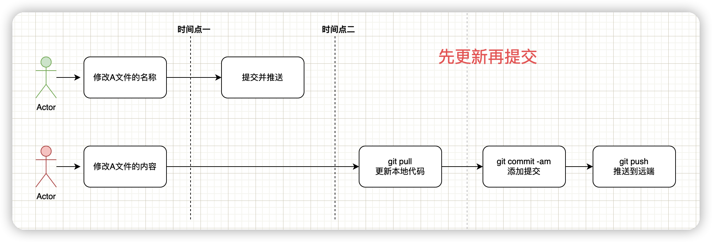

# 不同的人修改同一分支不同的文件

今天小红和小绿都在master分支上做开发。小绿在本地修改了A文件的内容，并提交推送到远程仓库。

后面小红在本地修改B文件的内容，在推送文件到远端仓库的时候，发现推送出错了。

```
hint: Updates were rejected because the tip of your current branch is behind
hint: its remote counterpart. Integrate the remote changes (e.g.
hint: 'git pull ...') before pushing again.
hint: See the 'Note about fast-forwards' in 'git push --help' for details.
```

在提示推送失败的时候，更新一下本地代码（`git pull`）即可。


我们也可以更加优雅一点，在提交（`git commit`）前更新一次代码，防止推送的时候出错。



> PS：先下手为强，后下手处理冲突，哈哈哈~
