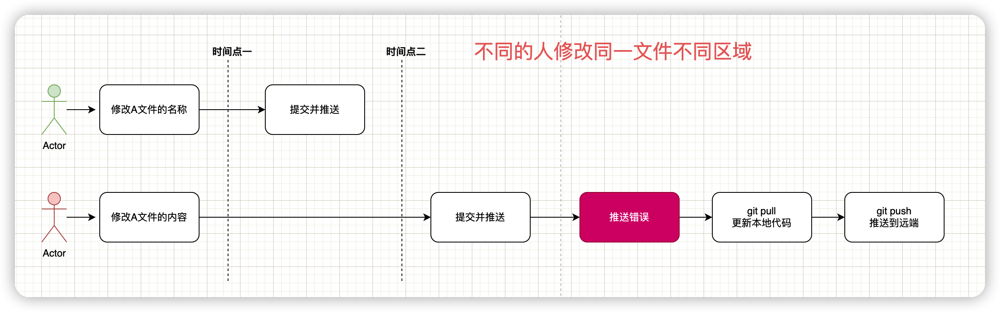
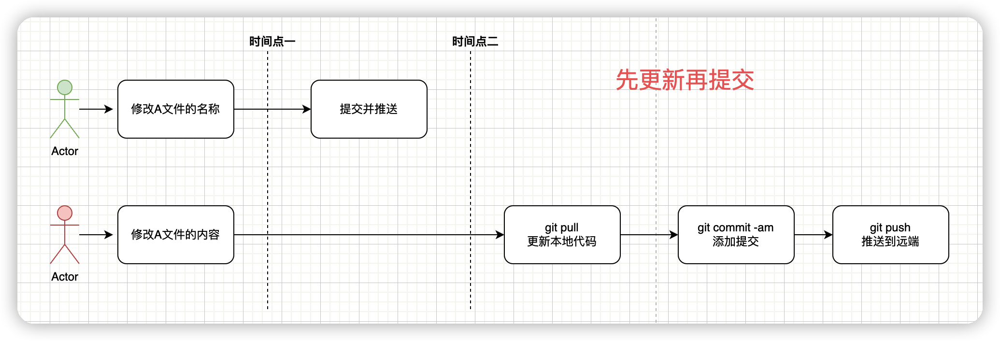
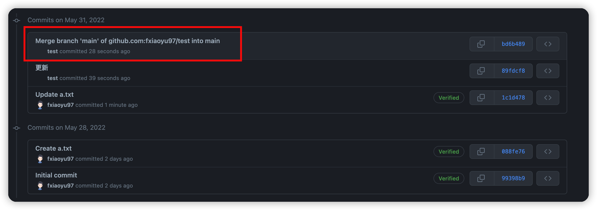

# 不同的人修改同一分支相同的文件的不同区域

今天小红和小绿都在master分支上做开发，这次他们修改的是同一个文件。小绿在本地修改文件的第一段代码，并把文件推送到远程仓库。

随后小红在本地修改该文件的第二段代码，在推送文件到远端仓库的时候发现出错了，这时候该怎么办呢？

这里小绿和小红虽然修改的是同一个文件，但是没有涉及到同一个区域，Git还是可以自动处理这种情况的。还是同样的配方：更新一下本地代码`(git pull)`，再推送。

我们也可以更加优雅一点，在提交（`git commit`）前更新一次代码，防止推送的时候出错。

## 注意事项

如果是先提交，再更新，最后推送到远端，提交记录中会多一条合并代码的记录，在意这条记录的同学就千万不要搞错顺序了。

## 绝杀技

同学们，你们有没有发现这里有一个绝杀技通吃一切问题，向小绿学习，先下手为强，修改的代码及时提交。
