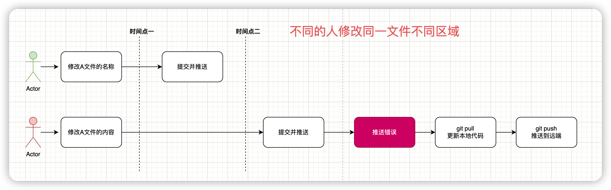
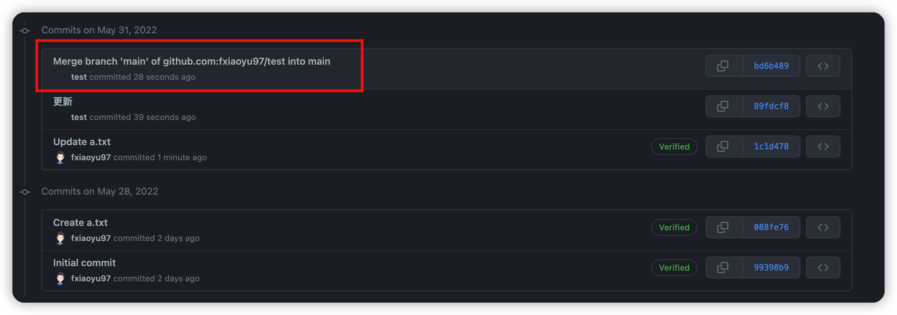

# git提交文件冲突时，该怎么办

## 背景

多人使用同一个远端仓库开发项目，这时候直接推送代码到同一远端仓库，然后就会出现一系列的文件修改冲突情况，接下来我们具体情况具体分析一下。

## 冲突情况

### 不同的人修改同一分支不同的文件

今天小红和小绿都在master分支上做开发，小绿修改A文件，小红修改B文件。小绿先把文件推送到远程仓库。然后小红再推送文件到远端仓库的时候，发现推送出错了。

```
hint: Updates were rejected because the tip of your current branch is behind
hint: its remote counterpart. Integrate the remote changes (e.g.
hint: 'git pull ...') before pushing again.
hint: See the 'Note about fast-forwards' in 'git push --help' for details.
```

不要慌，这是个小场面，只要更新一下本地代码（`git pull`）再推送一下即可。操作流程如下图所示：


### 不同的人修改同一分支相同的文件的不同区域

今天小红和小绿都在master分支上做开发，这次他们修改的是同一个文件，小绿修改文件的第一段代码，小红修改文件的第二段代码。小绿先把文件推送到远程仓库。然后小红再推送文件到远端仓库的时候，发现推送出错了。这时候该怎么办呢？

不要慌，这都是个小场面。虽然修改的是同一个文件，但是没有涉及到同一个区域，Git还是可以自动处理这种情况的。所以还是按照之前的方法，在提交之前，更新一下本地代码。




>  以上两种情况也是我们开发过程中最常见的情况，除了推送报错的时候我们这么干，那么我们是不是还有优雅的方法呢？
>
> 肯定是有的，就是在提交本地代码前，先更新一下本地代码，然后再提交推送。
>
> 
>
> 如果是先提交，再更新，最后推送到远端，提交记录中会多一条合并代码的记录，所有在意这条记录的同学就千万不要搞错顺序了。
>
> 

### 不同的人修改同一分支相同的文件的不同区域

今天小红和小绿都在master分支上做开发，这次他们修改的是同一个文件的同一区域，先提交的小绿还是很吃香的，后提交的小红还是冲突了，这时候该怎么办呢？

首先小红要更新代码`(git pull)`，然后发现有冲突的提示，但是 Git 还是做了自动合并，但是它把两次修改的内容都保留在文件中，由用户处理决定如何文件内容。


这时候冲突文件的状态会发生改变，变成未添加的状态，所以改变以后小红需要重新添加提交冲突的文件，这时候会多一次提交记录。

那是否有办法减少这次提交记录呢？

首先我们要知道一点，方法肯定是有的。当遇到这种冲突发生时，在提交代码前，我们不能直接拉取远程仓库的代码更新到本地，拉取远端代码的时候会提示错误。


注意看提示信息，在合并冲突前除了提交代码还有一个`stash`操作。

那就是我们先执行`git stash`，把本地的修改保存起来，然后执行`git pull`更新本地代码，接着执行`git stash pop`恢复本地的修改，这时候会发现自动合并冲突的提示，我们只要解决本地冲突的文件，接着添加文件即可，提交记录只有一次。


然后我们可以看一下远端的提交记录，如下所示：


最后终结一下操作流程：

