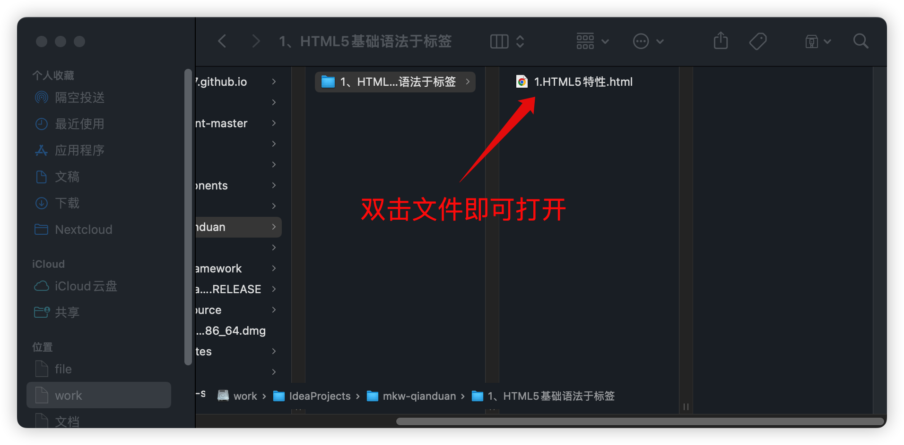

# 网页创建与浏览

## 创建网页

方法1

+ 创建一个空文件夹，在VSCode编辑器中打开这个文件夹
+ 按`ctrl+N`快捷键新建文件，保存格式必须要手动填写`.html`后缀

方法2

+ 在文件夹中直接点击鼠标右键“新建文本文件”
+ 将`.txt`格式文件改为`.html`文件，修改后缀名

HTML骨架的生成

+ 在VSCode中，输入`!`（英文感叹号），然后按tab键，即可自动生成HTML5骨架
+ 如果骨架没有生成，查看网页是否保存或者网页保存格式是不是`.html`后缀

## 浏览网页

直接在文件夹中双击网页文件。Chrome浏览器非常适合开发，所以将Chrome浏览器设置为默认的浏览器，杀毒软件、管家通常会阻止这个操作，请妥善设置杀毒软件相关设置

在VSCode中安装Live Server插件，这个插件可以自动刷新网页。安装完插件后，在VSCode中，打开文件，按`Ctrl+shift+p`，选择“Open With Live Server”即可。

使用这种方法必须注意：网页必须存放在文件夹中，且VSCode已经打开这个文件夹

