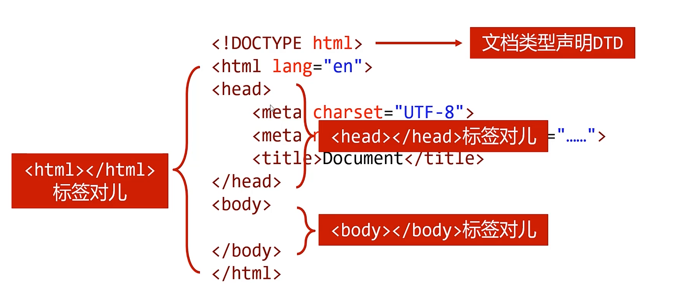
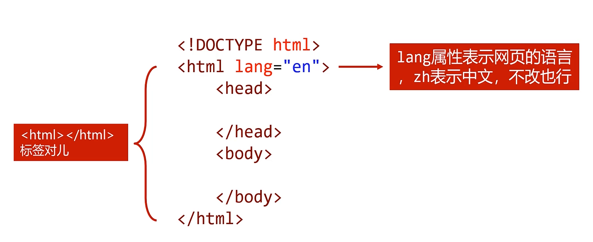
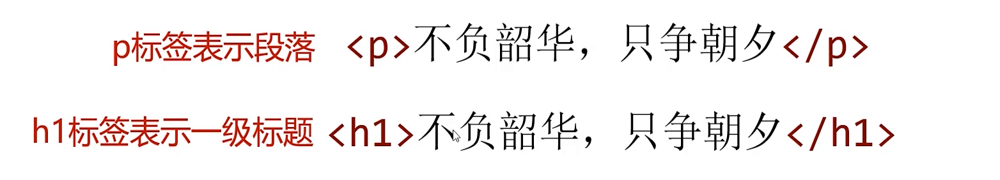
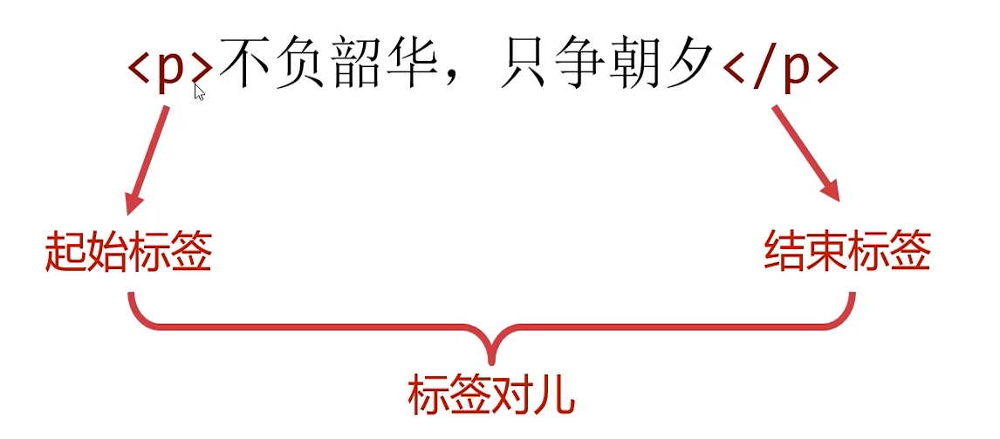
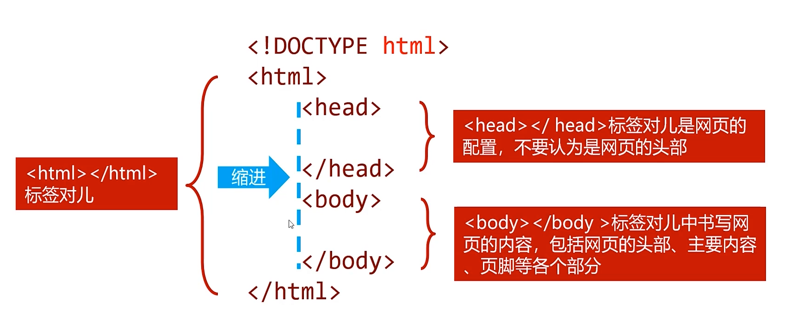
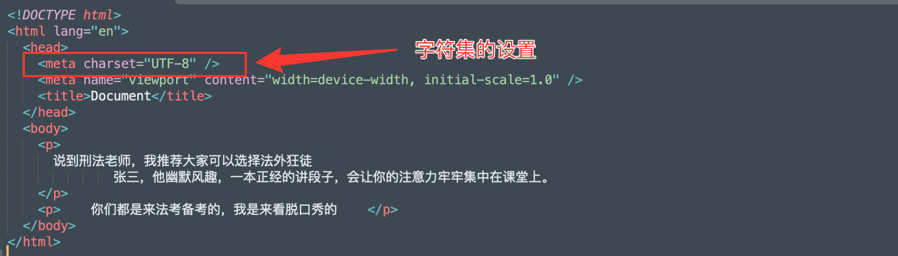
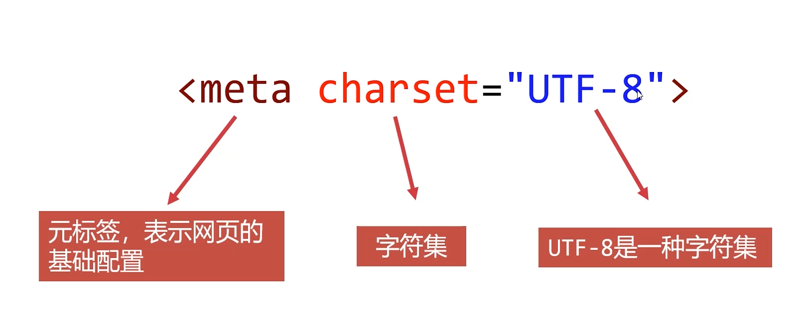
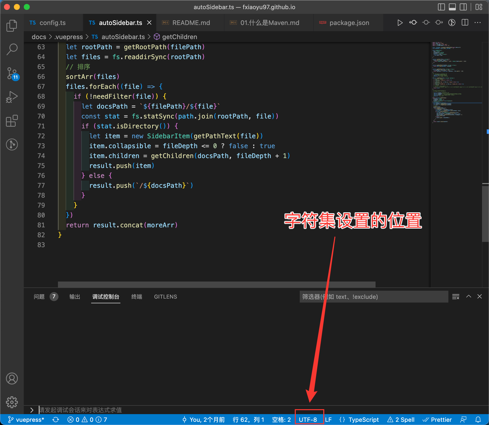
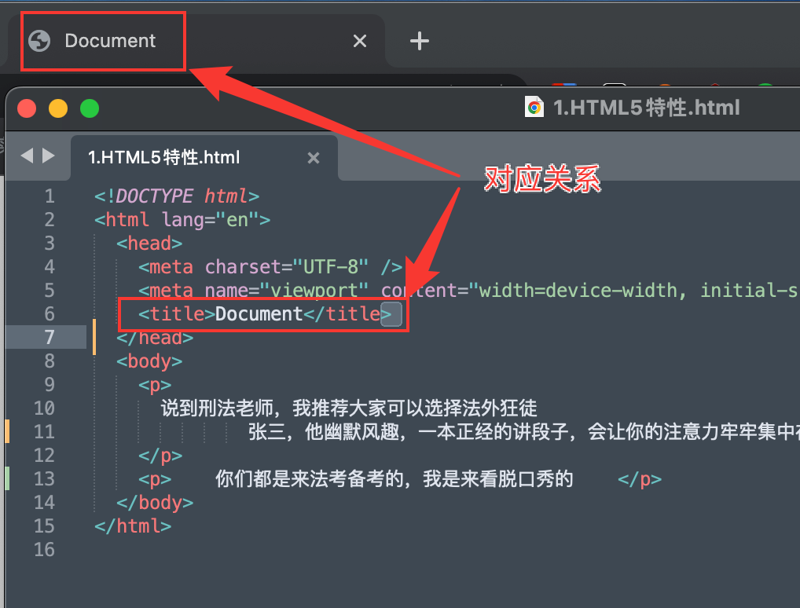

# 基础标签

## 一、认识HTML5骨架

基础代码结构如下所示



### 1.1 文档类型声明DTD

+ HTML文件第一行必须是DTD（Document Type Definition，文档类型声明）
+ 不写DTD会引发浏览器的一些兼容问题
+ 不同版本的HTML有不同的DTD写法

**不同版本的HTML的DTD**

+ `HTML5`：`<!DOCTYPE html>`
+ `HTML4.01`严格版：`<!DOCTYPE HTML PUBLIC "-//W3C//DTD HTML 4.01//EN" "http://www.w3.org/TR/html4/strict.dtd">`
+ `HTML4.01`过渡版：`<!DOCTYPE HTML PUBLIC "-//W3C//DTD HTML 4.01 Transitional//EN" "http://www.w3.org/TR/html4/loose.dtd">`
+ `HTML4.01`框架版：`<!DOCTYPE HTML PUBLIC "-//W3C//DTD HTML 4.01 Frameset//EN" "http://www.w3.org/TR/html4/frameset.dtd">`

### 1.2 `<html>`标签对



HTML叫做“超文本标记语言”，超文本标记就是标签。不同的标签都有不同的功能，标签可以给文字设置不同的“语义”



标签通常都是成对出现的



有的标签不是成对出现的，而是只有起始标签，称为单标签

```html
<meta charset="UTF-8">
<!-- 在HTML4时代，单标签必须写一个结尾的反斜杠，HTML5不用写-->
<meta charset="UTF-8" />
```

### 1.3 `<head>`和`<body>`标签对



## 二、`<head>`标签内容

### 2.1 字符集

**字符集设置出现的位置**



**字符集标签结构**



**常见的字符集**

| 字符集      | 涵盖字符                                                     | 1个汉字字节数 | 适用场景                                                     |
| ----------- | ------------------------------------------------------------ | ------------- | ------------------------------------------------------------ |
| UTF-8       | 涵盖全球所有国家、民族的文字和大量图形字符                   | 3             | 制作有非汉字文字的网页                                       |
| gb2312(gbk) | 收录所有汉字字符（包含简体、繁体）和英语、少量韩文、日语和少量图形字符 | 2             | 制作只有汉语和英语的网页，由于1个汉字仅占2字节，网页文件尺寸明显减少 |

> 无论使用哪种字符集，编辑器的编码方式要和文件保持相同的字符集，否则会出现乱码
>
> Live Server插件不支持`gb2312(gbk)`字符集，只支持`UTF-8`字符集



### 2.2 `<title>`标签

title标签用来设置网页的标题，文字会显示在浏览器的标签栏上



title也是搜索引擎收录网站时显示的标题，为了吸引用户的点击，合理设置title也是必要的

### 2.3 网页关键词和页面描述

+ 合理设置网页的网页关键词和页面描述，也是SEO的重要手段。
+ SEO（Search Engine Optimization，搜索引擎优化）利用搜索引擎的规则提高网站在有关搜索引擎内的自然排名，让网站在搜索引擎的结果中内占据领先地位
+ 使用`meta`标签设置网页关键词和描述，`name`属性非常关键，用来设置`meta`的具体功能

```html
<!-- 一定要注意单词大小写 -->
<meta name="Keywords" content="三更，编程，Java，前端，Vue">
<!-- 页面描述也是搜索引擎显示的简介词语 -->
<meta name="Description" content="记录编程学习过程中积累的知识点 整理，吸收，吐纳，归档。吾将上下而求索...">
```

## 三、`<body>`标签内容

### 3.1 标题标签

h系列标签表示“标题”语义，h是`headline`的缩写，一共有6个级别的标题。

| 标签 | 语义     |
| ---- | -------- |
| `h1` | 一级标题 |
| `h2` | 二级标题 |
| `h3` | 三级标题 |
| `h4` | 四级标题 |
| `h5` | 五级标题 |
| `h6` | 六级标题 |

+ 搜索引擎非常看重`<h1></h1>`标签的内容，应该将重点内容放到`<h1></h1>`中，比如网页的logo等。
+ `<h1></h1>`标签一般只能放置一个，否则会被搜索引擎视为作弊。实际开发中会出现多个`<h1>`标签的情况，只是不推荐。

### 3.2 段落标签

+ `<p></p>`标签表示段落标签，p是英语`paragraph`的意思
+ 任何段落必须写到到`<p></p>`标签中，因为html中即使代码换行了，页面显示效果也不会换行
+ `<p></p>`标签中不能嵌套h系列标签和其他p标签

PS：没有嵌套关系的标签不需要缩进

### 3.3 div标签

div是英语`division`（分割）的缩写，`<div></div>`标签就是将相关的内容组合在一起，以和其他内容分割，使内容更清晰。

`<div></div>`是最常见的HTML标签，因为它可以结合CSS使用，实现页面的布局，这种布局形式叫做“DIV+CSS”。这个标签就像一个容器，什么都可以容纳，因此工程师也习惯称呼`<div></div>`为盒子。

`<div>`标签可以添加class属性表示类名，类名服务于CSS

| 区域     | 类名    |
| -------- | ------- |
| 页头     | header  |
| logo     | logo    |
| 导航条   | nav     |
| 横幅     | banner  |
| 内容区域 | content |
| 页脚     | footer  |

```html
  <body>
    <!-- 页面头部 -->
    <div class="header">
      <!-- 页面的logo -->
      <div class="logo"></div>
      <!-- 页面的功能区 -->
      <div class="tool"></div>
      <!-- 页面的导航条 -->
      <div class="nav"></div>
    </div>
  </body>
```

