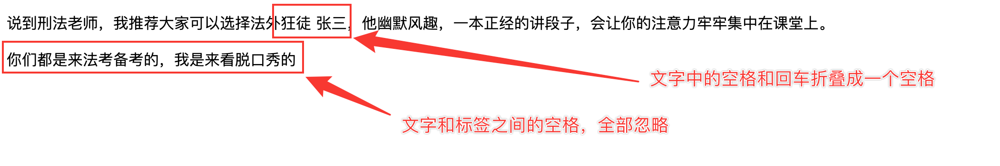

# HTML5特性

## 1、空白折叠现象

+ 文字和文字之间的多个空格、换行会被折叠成一个空格
+ 标签和文字之间的空格会被忽略

```html
<!DOCTYPE html>
<html lang="en">
  <head>
    <meta charset="UTF-8" />
    <meta name="viewport" content="width=device-width, initial-scale=1.0" />
    <title>Document</title>
  </head>
  <body>
    <p>
      说到刑法老师，我推荐大家可以选择法外狂徒
              张三，他幽默风趣，一本正经的讲段子，会让你的注意力牢牢集中在课堂上。
    </p>
    <p>    你们都是来法考备考的，我是来看脱口秀的    </p>
  </body>
</html>
```

**显示效果**



## 2、转义字符

| 转义字符 | 含义             |
| -------- | ---------------- |
| `&lt;`   | 小于号           |
| `&gt;`   | 大于号           |
| `&nbsp;` | 空格（不会折叠） |
| `&copy;` | 版权符号©️        |

## 3、HTML注释

在VScode中，可以使用快捷键`Ctrl+/`，注释语法如下所示：

```html
<!-- 注释内容 -->
```

