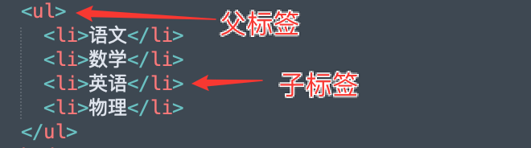
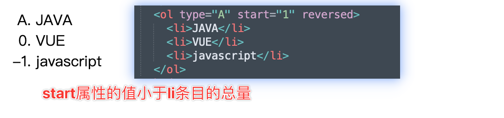
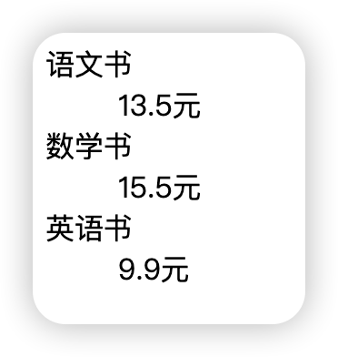
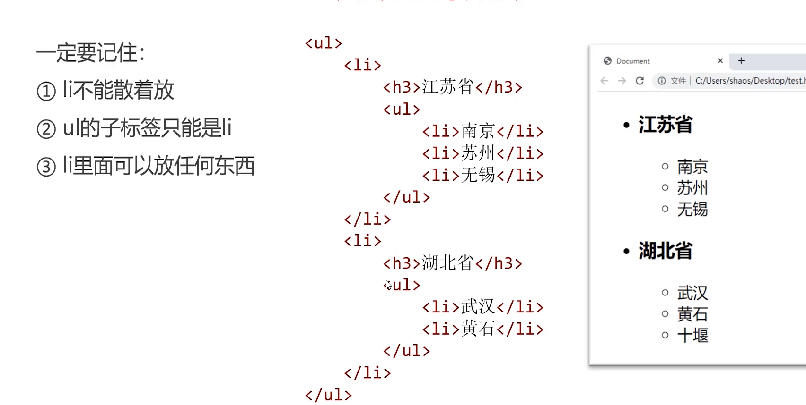

# 列表标签

## 一、无序列表

无序列表使用`<ul></ul>`标签，每个列表项都是`<li></li>`标签。

+ `ul`是`unordered list`（无序列表）的缩写
+ `li`是`list item`（列表项）的缩写

```html
    <ul>
        <li>语文</li>
        <li>数学</li>
        <li>英语</li>
        <li>物理</li>
    </ul>
```

无序列表是一个父子组合标签，`ul`是父标签， `li`是子标签。不能单独出现。当HTML标签形成嵌套时，需要注意代码的缩进。



~~无序列表有`type`属性，可以定义前导符号的样式，但是在HTML5中已经废弃，建议使用CSS替代~~

| type属性值 | 含义           |
| ---------- | -------------- |
| disc       | 默认值，实心圆 |
| circle     | 空心圆         |
| square     | 实心方块       |

## 二、有序列表

有序列表使用`<ol></ol>`标签，每个列表项都是`<li></li>`标签

+ `ol`是`ordered list`（无序列表）的缩写
+ `li`是`list item`（列表项）的缩写

```html
<ol>
  <li>JAVA</li>
  <li>VUE</li>
  <li>javascript</li>
</ol>
```

`<ol>`标签可以设置`type`属性，用来设置编号的类型

| type属性值 | 意义                 |
| ---------- | -------------------- |
| `a`        | 表示小写英文字母编号 |
| `A`        | 表示大写英文字母编号 |
| `i`        | 表示小写罗马数字编号 |
| `I`        | 表示小写罗马数字编号 |
| `1`        | 表示数字编号（默认） |

**示例代码**

```html
<ol type="1">
  <li>JAVA</li>
  <li>VUE</li>
  <li>javascript</li>
</ol>
```

`<ol>`标签可以设置`start`属性，用来执行编号的起始值，不管`type`属性是什么值，此属性值应为**阿拉伯数字**

**示例代码**

```html
<ol type="A" start="5">
  <li>JAVA</li>
  <li>VUE</li>
  <li>javascript</li>
</ol>
```

`<ol>`标签可以设置`reversed`属性，用来指定列表中的条目是否为倒序排列。`reversed`属性不需要值，只需要写`reversed`单词即可，这是HTML5的全新特性

**示例代码**

```html
<ol reversed> </ol>
```

**当同时使用`start`和`reversed`属性，且`start`属性的值小于列表条目数量时，会出现数字倒序**



## 三、定义列表

如果需要逐条给出定义描述的列表，就是定义列表

+ `<dl>` 是`definition list`（定义列表）的缩写
+ `<dt>` 是`data term`（数据项）的缩写
+ `<dd>` 是`data definition`（数据定义）的缩写

**示例代码**

```html
<dl>
  <dt>语文书</dt>
  <dd>13.5元</dd>
  <dt>数学书</dt>
  <dd>15.5元</dd>
  <dt>英语书</dt>
  <dd>9.9元</dd>
</dl>
```

默认显示效果如下所示：



### 什么时候使用定义列表

+ 语义上有“解释说明”含义的文字，且为列表形态，应该使用定义列表

## 四、列表的嵌套



## 五、注意事项

+ `<li>`标签不能单独使用，它必须放在`<ul>`或者`<ol>`中使用

+ HTML规定，`<ul>`和`<ol>`的子标签只能是`<li>`，绝对不能出现其他任何标签

+ `<li>`标签是容器，内部可以放任何其他标签

  ```html
      <ul>
        <li>语文
          <p>语文好</p>
        </li>
        <li>数学</li>
        <li>英语</li>
        <li>物理</li>
      </ul>
  ```
