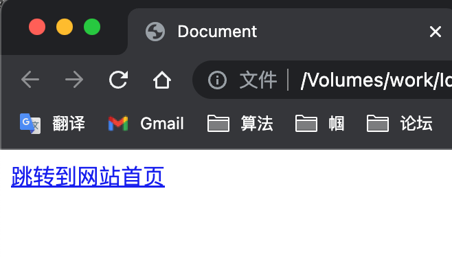
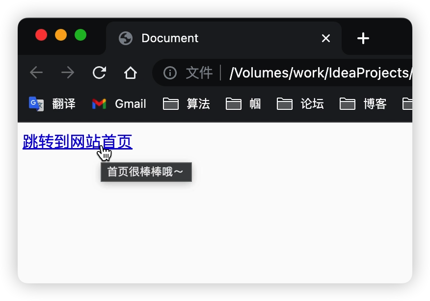

# 多媒体与语义化标签

## 图片标签

图片标签也是指``标签，通常用来在网页中插入图片

**示例代码**

```html

```

+ `img`是`image`（图片）的缩写
+ `src`是`source`（来源）的缩写
+ `src`的值是图片的存储目录和完整文件名，图片名称前面的是目录名，图片名称一定要写后缀名
+ 图片本质上没有被插入到网页中，只是被引入到了网页中

如果使用相对路径，图片必须复制到项目文件夹中，使用绝对路径，则不需要关注图片的位置。

> 相对路径：是指从当前文件位置开始，如何能找到图片。随着网页和图片位置关系不同，插入图片的代码也会改变。比如“前面路由右转，直行100米就到了”。如果想要回退上一级目录，使用`../`的写法。
>
> 绝对路径：相对于根目录的路径，或者带有网络域名的地址。只要文件位置不改变，它的绝对路径是恒定不变的。比如“上海市浦东新区陆家嘴世纪大道1号”

### alt属性

**示例代码**

```html

```

+ `alt`属性是`alternate`（替代品）的缩写，它是对图像的文本描述，不是强制性的
+ 如果由于某些原因无法加载图像，浏览器会在页面上显示`alt`属性中的备用文本
+ 供视力不方便的朋友使用网页朗读器，也会朗读`alt`属性中的文本

### `width`和`height`属性

**示例代码**

```html

```

+ `width`和`height`属性分别设置宽度和高度，单位是像素，不用写单位
+ 如果省略其中一个属性，则按照原始比例缩放图片，所以一般可以只设置一个属性

### 网页上支持的图片格式

| 格式          | 说明                                                 |
| ------------- | ---------------------------------------------------- |
| `.bmg`        | windows画图软件默认保存的格式，位图                  |
| `.gif`        | 支持动图（比如表情包）                               |
| `.jpeg(.jpg)` | 有损压缩图片，常用于照片                             |
| `.png`        | 便携式网络图像，用于logo、背景图等，支持透明和半透明 |
| `.svg`        | 矢量图片                                             |
| `.webp`       | 最新的压缩算法非常优秀的图片格式                     |

## 超级链接

超级链接是将网页和网页连接到一起的方法，可以从一个网页跳转到另一个网页，也就是互联网

### `<a>`标签

`<a>`标签可以制作超级链接

**示例代码**

```html
<a href="home.html">跳转到网站首页</a>
```

+ `a`是`anchor`（锚）的首字母
+ `href`是`hypertext reference`（超文本引用）的缩写
+ `href`属性支持相对路径和绝对路径



### `<a>`标签的`title`属性

用于设置鼠标悬停时显示的提示文本

**示例代码**

```html
<a href="home.html" title="首页很棒棒哦～">跳转到网站首页</a>
```



### 在新窗口中打开网页

将`<a>`标签的`target`属性设置为`blank`，即可在新标签页打开网页

**示例代码**

```html
<a href="home.html" target="blank">跳转到网站首页</a>
```

在HTML4时代，blank 之前有一个下划线

**示例代码**

```html
<a href="home.html" target="_blank">跳转到网站首页</a>
```

### 图片添加超级链接

使用`<a>`标签包裹``标签即可

**示例代码**

```html
<a href="home.html" target="blank">
  
</a>
```

### 页面内锚点

遇到较长的页面，可以适当的给`h`标签添加`id`属性，它将成为页面的“锚点”

```html
<h1 id="nanjing">南京美食</h1>
```

当网页后面添加`#`时，页面会自动滚动到锚点所在位置。访问地址：`http://127.0.0.1:5500/test.html#nanjing`

在其他页面也可以通过超级链接，连接到指定的锚点

**示例代码**

```html
<a href="test.html#nanjing">南京美食</a>
```

返回顶部的锚点，这是一个固定的锚点 `#top`

**示例代码**

```html
<a href="#top">返回顶部</a>
```

### 下载链接

一般是指向`exe、zip、rar`等文件格式的链接，都会自动成为下载链接

**示例代码**

```html
<a href="test.zip">下载文件</a>
```

### 邮件链接

有`mailto:`前缀的链接是邮件链接，系统将自动打开Email相关软件

**示例代码**

```html
<a href="mailto:sangeng@test.com">给三更菌发邮件</a>
```

### 电话链接

有`tel:`前缀的链接是电话链接，系统将自动打开拨号盘

**示例代码**

```html
<a href="tel:12315">打电话投诉</a>
```

## 音频标签

在浏览器中插入音频需要使用`<audio>`标签，兼容到IE9。一般常用的音频格式是`mp3`和`ogg`格式

**示例代码**

```html
<audio controls src="音频地址">抱歉，您的浏览器不支持audio标签，请升级浏览器</audio>
```

+ `controls`属性表示显示播放控件
+ 标签对中是对不兼容audio标签的浏览器的显示文字

### autoplay属性

使用`autoplay`属性，音频会自动播放。常用的浏览器为了不打扰用户，可能会不允许自动播放音乐，必须让用户手动点击之后才能播放

### loop属性

声明loop属性，将循环播放音频

## 视频标签

在浏览器中插入音频需要使用`<video>`标签，兼容到IE9。常见的视频格式是`mp4、ogv、webm`等

**示例代码**

```html
<vedio controls src="音频地址" loop autoplay>抱歉，您的浏览器不支持audio标签，请升级浏览器</vedio>
```

+ `controls`属性表示显示播放控件
+ `autoplay`属性，视频会自动播放
+ loop属性，循环播放视频
+ 标签对中是对不兼容vedio标签的浏览器的显示文字

大纲标签

语义化标签