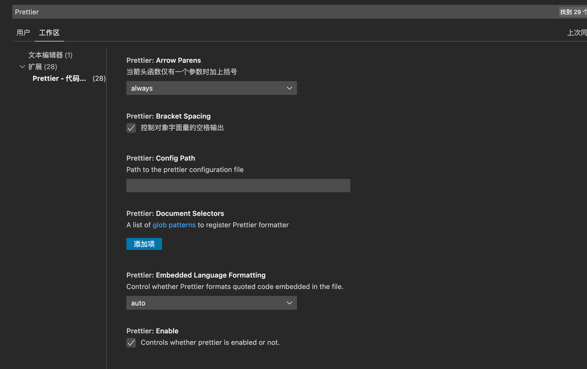

# vite.config.ts 格式化失败

## 问题描述

VS Code 开启了保存文件自动格式化，安装了`Prettier - Code formatter`插件，在项目根目录下创建了相关配置文件`.prettierrc`，在文件中定义了文件格式。

自动保存格式化的时候，只对`src`文件夹下的文件生效，根目录下的文件未生效，例如`vite.config.ts`格式化失败。

## 原因

未知，猜测跟路径相关

## 解决方法

打开设置，搜索`Prettier`，在拓展中找到`Prettier`，修改相关配置信息，保存即可。

注意作用域，是选择用户还是工作区。

