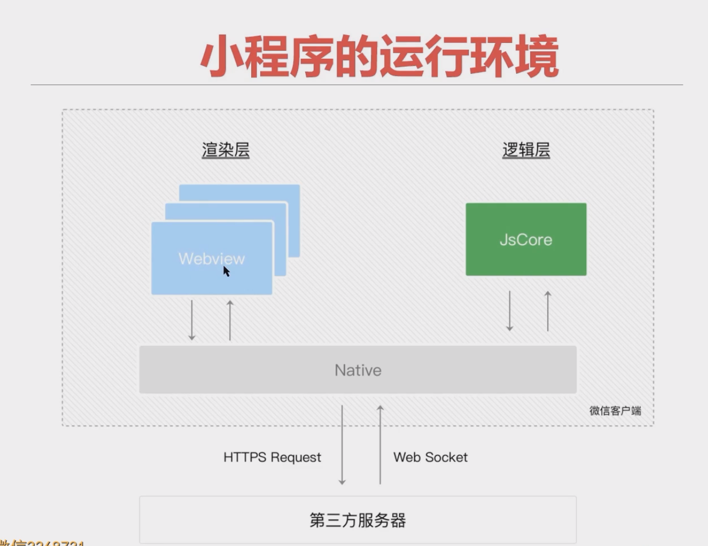

# 一、项目的基础组成结构

**问题：**

> 1. 一个小程序的页面由什么组成？
> 2. project.config.json 文件的作用是什么？
> 3. sitemap.json 文件的作用是什么？

+ pages：所有的小程序页面，每个页面以单独的文件夹存在
  + index：index 页面文件夹，文件夹下面都包含4个基本的页面文件，这四个文件共同组成index页面
    + index.js：`.js`文件，当前页面的脚本文件，存放页面的数据、事件处理、生命周期等
    + `index.json`：`.json`文件，当前页面的配置文件，配置页面的外观
    + index.wxml：`.wxml`文件，当前页面的模板结构文件
    + index.wxss：`.wxss`文件，当前的样式表文件
+ utils：工具类文件夹
+ app.js：小程序的项目逻辑文件，用来注册小程序实例，绑定生命周期回调函数、错误监听和页面不存在监听函数等。
+ app.json：小程序公共配置文件，决定页面文件的路径、串口表现、设置网络超时时间、设置多个tab等
+ app.wxss：小程序共偶那个样式表
+ project.config.json：是项目配置文件，用来记录我们对小程序开发工具所做的个性化配置
  + `setting`保存编译相关配置
  + `projectname`保存项目名称
  + `appid`保存小程序的账号ID
+ sitemap.json：配置小程序及其页面是否允许被微信索引
  + rules中保存了索引规则列表的配置
  + rules规则中，action表示页面是否能被索引（allow，disallow），page表示生效的页面

## wxml VS html

> 1.我是否可以在 wxml 文件中，写入 div 标签？并说出原因
>
> 可以写入 div 标签，但是不要使用。div 标签会被解析成类 view 标签效果。不能被识别的标签都会渲染成类view标签

### 1、什么是wxml

`WXML（WeiXin Markup Language）`是框架设计的一套标签语言（组件），用来构建小程序页面端的结构，其作用类似于网页开发中的 `HTML`

### 2、WXML 和 HTML 区别

+ 标签名称不同
  + `HTML（div、span、img、a）`
  + `WXML（view、text、image、navigator）`
+ 属性节点不同
  + `<a href="#">超链接</a>`
  + `<navigator url="/pages/home/home">跳转到home页</navigator>`
+ 提供了动态渲染数据的模板语法
  + 数据绑定
  + 条件渲染
  + 列表渲染

## wxss VS css

> 1、wxss 新增了什么尺寸单位
>
> 2、wxss中推荐使用什么选择器？

1、什么是`WXSS`

+ `WXSS（WeiXin Style Sheets）`是一套样式语言，用于描述WXML的组件样式，类似于网页开发中的 CSS 。WXSS 具有 CSS 大部分特性。

2、新增了尺寸单位 ——`rpx`，一个 rpx 为页面宽度 `1 / 750`

3、提供了全局的样式和局部样式

+ 全局样式：写入到**根目录的wxss**中的样式
+ 局部样式：写入到**页面的wxss**中的样式
+ 两者都定义相同的样式时，局部样式优先级高

4、WXSS 支持部分 CSS 选择器

+ `.class`（推荐使用）和 `#id`
+ `element`
+ 并集选择器和后代选择器
+ `::after` 和`::before`等伪类选择器

## .json 配置文件

> 小程序中的 .json 文件主要分为哪两种？
>
> 当这两种配置文件出现相同配置时，会出现什么结果

小程序中，额外多出一个 .json 的配置文件，.json 文件主要分为两个：

项目根目录下的 .json 文件 和 页面文件夹下的 .json 文件。

+ 项目根目录下的 .json 文件，可以修改项目的基础配置，首页等
+ 页面中的 .json 文件，修改页面的基础配置（优先级高）

## 宿主概念与小程序的运行环境

1、什么是宿主环境？

宿主环境：程序运行所必须的依赖环境

小程序的宿主环境：手机微信

2、小程序的运行环境是如何划分的？

## 小程序的内置组件

1. view
2. scroll-view
3. swiper && swiper-item
4. text && rich-text
5. button
6. image

