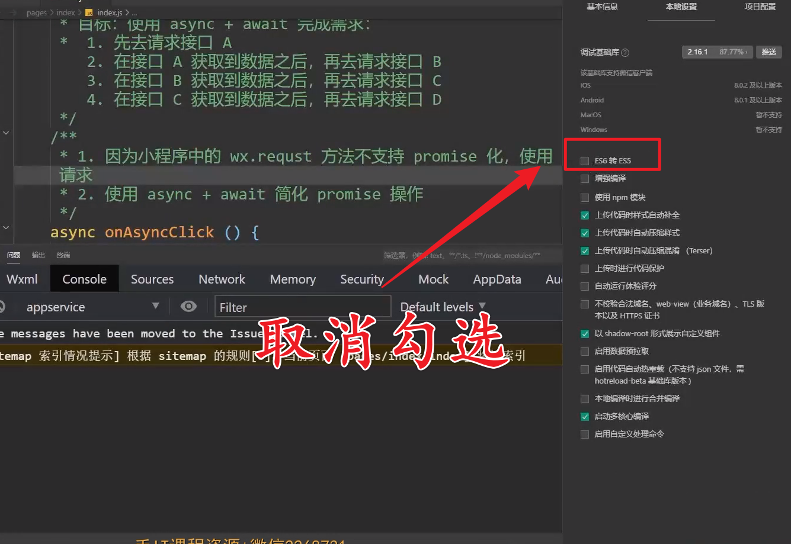

# 小程序核心语法

## 1、数据驱动原则

### 1、什么是数据驱动？

当数据发生变化时，视图理应发生变化

### 2、在小程序中如何完成数据绑定？

在`data`中定义数据，然后在`wxml`中通过`{{}}`使用数据

## 2、点击事件

### 1、如何为按钮添加点击事件？

小程序中点击事件不是 click 而是 tap，监听 tap 事件需要用到 bind

+ `bindtap`（推荐）
+ `bind:tap`

```html
<button type="primary" bindtap="onAddNum">num + 1</button>
```

### 2、如何修改data中数据的值？

```javascript
// 定义数据
data: {
    product: {
        price: 10,
        num: 5
    }
},
onAddNum (){
    // 修改 data 的数据，涉及到setData
    // key 代表：修改的数据
    // val 代表：当前key的最新值
    // this.setData({
    //    'msg':'我是最新值'
    // })
    this.setData({
        // key ：product 对象的 num 属性
        // val ：当前 key 的最新值
        'product.num': this.data.product.num + 1
    })
}
```

### 3、如何为点击事件传递参数

为点击事件传递参数，涉及到两部分：

+ `event` 对象：形参
+ `data-` 属性：实参

小程序中不能直接为回调方法传递实参，需要使用属性绑定的形式，把需要传递的参数绑定到当前 DOM 节点的 `data-xx` 属性下。

```html
<!-- 调用onAddNum函数，传递参数为 5 -->
<button type="primary" bindtap="onAddNumN" data-step="5">num + N</button>
```

通过 `e.target.dataset` 访问传递的实参

```javascript
onAddNumN(e) {
    // 获取的参数值为字符串，需要转换成数字
    const step = parseInt(e.target.dataset.step)
    // 修改num
    this.setData({
        'product.num': this.data.product.num + step
    })
}
```

## 3、双向数据绑定

> 创建一个数字输入框，输入框于【商品数量完成双向数据绑定）即：
>
> 1. 输入框内容（视图）发生变化时，商品的数量（数据）同步跟随发生变化
> 2. 商品数量（数据）发生变化时，输入框内容（视图）同步跟随发生变化

```html
<!-- 1、创建一个数字输入框 -->
<!-- 2、设置【商品数量】为输入框的初始值 -->
<!-- 3、监听用户的输入行为(bindinput) -->
<input type="number" value="{{product.name}}" bindinput="onInput"/>
```

```javascript
onInput(e) {
    // 4、获取用户输入的值
    const val = parseInput(e.detail.value)
    // 5、赋值给【商品数量】
    this.setData({
        'product.num': val
    })
}
```

### 小程序中如何实现双向数据绑定？

1. 通过`value`为`input`视图绑定数据
2. 通过监听 `bindinput` 获取视图变化，在回调中修改数据

## 4、条件渲染

主要分为两种形式：

1. `wx:if ... wx:elif ... wx:else`：判断结果为`true`则渲染，否则不进行渲染
2. `hidden`：结果为`true`则隐藏，否则不隐藏

```html
<view>
    售货员小姐姐对你发出一声惊呼
    <text wx:if="{{product.price * product.num <= 100}}">hello帅哥</text>
    <text wxelif="{{product.price * product.num > 100 &&product.price *  product.num < 1000}}">哇哦，有钱人哦</text>
    <text wx:else>士豪 你好</text>
</view>
```

**注意点：**

一般来说，`wx:if`有更高的切换消耗，而`hidden`有更高的初始化渲染消耗。因此，如果需要频繁切换的情景下，用`hidden`更好。如果在运行时条件不大可能改变，使用`wx:if`更好。

##  5、列表渲染

代码格式：`wx:for="{{ 要循环的列表 }}"`

循环时，会有一些默认的当前项和下标名称：

+ 默认的当前项变量名为：item
+ 默认的下标变量名为：index

**注意：`wx:for`必须配合 `wx:key` 进行使用，`wx:key` 可以提高 for 循环的性能。对应的 key 值必须是一个不可以重复的值，使用`index`作为`wx:key`的表达式是不需要使用`{{}}`**

```html
<view>
    <!-- block 组件：包裹性质的容器，不会进行渲染 -->
    <block wx:for="{{ products }}" wx:key="index">
        <view class="product-item">
            <text>索引：{{ index }}</text>
            <text>商品名：{{ item.name }}</text>
            <text>价格：{{ item.price }}</text>
        </view>
    </block>
</view>
```

##  6、数据请求

小程序的宿主环境为【微信小程序客户端】，所以小程序中不存在【跨域问题】

`ajax` 依赖 `HMLHTTPRequest` 对象，而小程序宿主环境为【微信小程序客户端】，所以小程序中的【网络请求】不是 ajax 请求。

**限制：**

1. 只能请求 HTTPS 类型的接口
2. 必须把接口的域名添加到信任列表中（开发环境中，可以勾选【不校验合法域名】）

```javascript
wx.request({
    url: 'https://127.0.0.1/api/test/getList',
    method: "GET",
    success: (res) => {
        console.log(res)
    }
})
```

## 7、异步编程解决方案

> 1. 先去请求接口 A
> 2. 在接口 A 获取到数据之后，再去请求接口 B
> 3. 在接口 B 获取到数据之后，再去请求接口 C
> 4. 在接口 C 获取到数据之后，再去请求接口 D

```javascript
const isA = true
const isB = true
const isC = true
const isD = true
function A(cb) {
    console.log('执行 A 接口的逻辑')
    setTimeout(() => {
        if (isA) {
            cb('接口 A 执行完成')
        } else {
            cb('接口 A 执行失败')
        }
    }, 1 * 1000)
}
function B(cb) {
    console.log('执行 B 接口的逻辑')
    setTimeout(() => {
        if (isA) {
            cb('接口 B 执行完成')
        } else {
            cb('接口 B 执行失败')
        }
    }, 1 * 1000)
}
function B(cb) {...}
function C(cb) {...}
function D(cb) {...}
```

一般实现，会出现回调地狱：回调函数中大量嵌套导致出现【复杂且难以阅读】的逻辑

```javascript
A(function (res) {
    console.log(res)
    B(function (res) {
        console.log(res)
        C(function (res) {
            console.log(res)
            D(function (res) {
                console.log(res)
            })
        })
    })
})
```

### 1、使用 Promise 进行定义接口

Promise 对象用于表示一个异步操作的最终完成（或失败）及其结果值。

它是一个构造函数，所以可以通过 new 关键词来构建它，获取实例。

在 Promise 中，分为了三种状态：

1. 待定（pending）：初始状态，既没有被兑换，也没有被拒绝
2. 已兑现（fulfilled）：意味着操作成功完成
3. 已拒绝（rejected）：意味着操作失败

可以通过 promise 实例的三个方法，进行链式调用来解决回调地狱问题

1. 成功：`promise.then()`
2. 失败：`promise.catch()`
3. 结束：`promise.finally()`

```javascript
const isA = true
const isB = true
const isC = true
const isD = true
function A() {
    // 1、创建 Promise 实例
    // 2、构造函数中接收一个回调函数
    // 3、resolve：是一个回调函数，表示 Promise 执行成功
    // 4、reject：是一个回调函数，表示 Promise 执行失败
    return new Promise((resolve, reject) => {
        // 5、处于 待定（pending） 下，代码会立即执行
        console.log('执行接口 A 的逻辑')
        setTimeout(() => {
            if (isA) {
                resolve('接口 A 执行完成')
            } else {
                reject('接口 A 执行失败')
            }
        }, 1 * 1000)
    })
}
```

怎么使用 promise 的实例呢？

```javascript
// 1. 接收【已兑换（fulfilled）】的结果：`promise.then()`
// 2. 接收【已拒绝(rejected)】的结果：`promise.catch()`
// 在 .then 中，可以继续 return 一个 promise 实例，这个 return 的实例，可以在下一次的 .then 中接收结果
const promise = A()
const promiseB = promise.then(res => {
    console.log(res)
    return B()
})
promiseB.then(res => {
    console.log(res)
    return C()
})

// 可以改成链式调用的方式
A()
    .then(res => {
        console.log(res)
        return B()
    })
    .then(res => {
        console.log(res)
        return C()
    })
    .then(res => {
        console.log(res)
        return D()
    })
    .then(res => {
        console.log(res)
    })
```

### 2、使用 async + await

+ `async + await`必须配合`promise`使用，同时`async`和`await`必须一起使用
+ `async + await`可以简化`promise` 的异步操作，把`promise`的异步操作编程【同步的写法】
+ async：标记一个函数，把一个函数标记为【异步函数】
+ await：需要在【异步函数】中使用，标记当前的操作为【异步操作】

```javascript
async function test() {
    const resA = await A();
    console.log(resA)
    const resA = await B();
    console.log(resB)
    const resA = await C();
    console.log(resC)
    const resA = await D();
    console.log(resD)
}
```

### 3、小程序中使用promise

小程序中的 `wx.requeset` 方法不支持 promise 化，使用 promise 封装 `wx.request` 请求

```javascript
pA() {
    return new Promise((resolve, reject) => {
        console.log('执行A接口的逻辑')
        wx.request({
            url: 'urlA',
            success: (res) => {
                resolve(res)
            },
            fail: (err) => {
                reject(err)
            }
        })
    })
}
```

配合 async + await 调用方法

```javascript
async onAsyncClick () {
    const resA = await this.pA();
    console.log(resA)
    const resA = await this.pB();
    console.log(resB)
    const resA = await this.pC();
    console.log(resC)
    const resA = await this.pD();
    console.log(resD)
}
```

注意，如果出现错误信息：`TypeError：Cannot read property 'mark' of undefined`，表示当前不支持 async 和 await 



## 8、生命周期

生命周期：一件事物由创建到销毁的全过程

生命周期函数：生命周期中的关键时刻

  **页面的生命周期**

+ `onLoad()`：监听页面加载，页面传参时涉及到
+ `onReady()`：监听页面初次渲染完成，页面出现之后，可以请求服务端获取数据，并进行渲染
+ `onShow()`：监听页面显示
+ `onHide()`：监听页面隐藏
+ `onUnload()`：监听页面卸载

## 9、PullToRefresh下拉刷新与上拉加载

分页就是当列表中数据过多时，一次性加载所有的数据会导致请求过慢，所以前端就会分页来加载数据。

整个【分页加载】分为两部分：

1. 上拉加载（`onReachBottom`）
2. 下拉刷新

这两部分需要分别来进行处理，首先我们先来看【上拉加载】

**上拉加载：**

在【用户上拉】时，我们希望获取【下一页】的数据，所以我们需要对当前的数据进行分页

在小程序中，默认已经实现了上拉加载的功能，可以直接通过监听 `onReachBottom` 函数，来监听：页面上拉触底事件。当页面滑动到底部时，会触发 `onReachBottom` 函数

```javascript
data: {
  page: 1,
  size: 10,
  total: -1,
  listData: []
},
/**
* 生命周期函数--监听页面初次渲染完成
*/
onReady: async function () {
  console.log('onReady');
  // 请求服务端获取数据
  // 页面出现之后，可以获取接口数据，并进行渲染
  const data = await this.getList()
  this.setData({
      listData: data.list,
      total: data.total
  })
},
/**
* 页面上拉触底事件的处理函数
*/
onReachBottom: async function () {
    // 当已经没有新数据之后，不再发起请求
    if (this.data.total === this.data.listData.length) 
        return;
    console.log('onReachBottom');
    // 1、修改page
    this.setData({
        page: this.data.page + 1
    })
    // 2、获取最新数据
    const data = await this.getList()
    // 3、新获取到的数据补充到现有数据的后面
    this.setData({
        listData: [...this.data.listData, ...data.list]
    })
}
```

另外在页面中添加一个底线的标签

```html
<!-- 底线 -->
<view wx:if="{{ listData.length === total }}" >-- 我也是有底线的！ --</view>
```

**下拉刷新：**

想要在【小程序】中实现【下拉刷新】，首先要在配置文件中开启

```json
// 页面.json
{
    "backgroundColor": "#cccccc",
    "enablePullDownRefresh": true
}
```

当我们开启【下拉刷新】之后，我们需要去监听`onPullDownRefresh` 函数，这个函数会在：用户下拉刷新时进行回调

```javascript
onPullDownRefresh: async function () {
    // 1、重置页数
    this.setData({
        page: 1
    })
    // 2、获取最新的数据
    const data = await this.getList()
    // 3、使用新数据覆盖旧数据
    this.setData({
        listData: data.list
    })
    // 4、关闭下拉刷新的动作（在真机中，下拉刷新的动作是不会自动关闭的）
    wx.stopPullDownRefresh()
}
```

## 10、页面跳转

> 1. 页面跳转的方式有凡种？
> 2. 跳转到tabbar页面和非tabbar页面的方式分别是什么？
> 3. 如何进行导航传参？

小程序中页面跳转分为两种方式：

1、声明式导航

+ 跳转到 tabbar 页面
+ 跳转到 非tabbar 页面
+ 后退页面

2、编程式导航

+ 跳转到 tabbar 页面
+ 跳转到 非tabbar 页面
+ 后退页面

**声明式导航：**

【小程序】中提供了一个：跳转页面的组件：navigator，这个组件可以完成【声明式导航】

```html
<!-- 跳转到 非tabbar 页面 -->
<!-- url 的表达式必须以 / 开头 -->
<navigator url="/pages/detail/detail">声明式导航：跳转到非tabbar页面</navigator>

<!-- 跳转到 tabbar 页面 -->
<navigator open-type="switchTab" url="/pages/index/index">声明式导航：跳转到tabbar页面</navigator>

<!-- 后退页面 -->
<navigator open-type="navigateBack" url="/pages/index/index">声明式导航：后退页面</navigator>
```

**编程式导航：**

小程序中提供了三个 API，用来进行编程式导航：

1、`wx.switchTab` 跳转到 tabBar 页面，并关闭其他所有非 tabBar 页面

```html
<!-- 编程式导航跳转到首页 -->
<button type="primary" bindtap="onSwitchToHome">利用 switchTab 跳转到首页</button>

<script>
    onSwitchToHome () {
        wx.switchTab({
            url: '/pages/index/index',
        })
    }
</script>
```

2、`wx.navigateTo` ：保留当前页面，跳转到应用内的某个页面，但是不能跳转到 tabBar 页面

```html
<!-- 编程式导航跳转到详情页面 -->
<button type="primary" bindtap="onNavigateToDetail">利用 navigateTo 跳转到详情页</button>

<script>
    onNavigateToDetail () {
        wx.navigateTo({
            url: '/pages/detail/detail',
        })
    }
</script>
```

2、`wx.navigateBack` ：关闭当前页面，返回上一页面或多级页面

```html
<!-- 编程式导航后退页面 -->
<button type="primary" bindtap="onNavigateBack">利用 navigateBack 后退页面</button>

<script>
    onNavigateToDetail () {
        wx.navigateBack({
            detail: 1,
        })
    }
</script>
```

**导航传参：**

小程序的导航传参遵循：get请求的标准：

+ 以`?`分割`url`和参数
+ 以`=`连接参数的`key`和`value`
+ 以`&`来拼接参数

那么下面我们来完成案例的最后一个功能：点击跳转时，传递当前item的索引和标题，并且在detail页面中展示

```html
<!-- 声明式导航传递参数 -->
<navigator url="/pages/detail/detail?index={{index}}&title={{item.title}}">{{ index }} -- {{ item.title }}</navigator>

<!-- 编程式导航传递参数 -->
<button type="primary" bindtap="onNavigateToDetaii" data-index="{{index}}" data-title="{{item.title}}">利用navigateTo进入详情页</button>

<script>
    onNavigateToDetail(e){
        const { index, title }= e.target.dataset
        wx.navigateTo({
            url: `/pages/detail/detail?index=${index}&title-${title}`
        })
    }
</script>

<!-- 在detail 中接收数据，并展示 -->
<view class="msg">index:{{index}}-- title:{{title}}</view>

<script>
    onLoad: function (options) {
        const {index,title} = options
        this.setData({
            index,
            title
        })
    }
</script>
```

