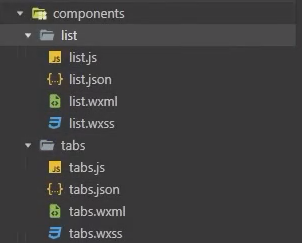
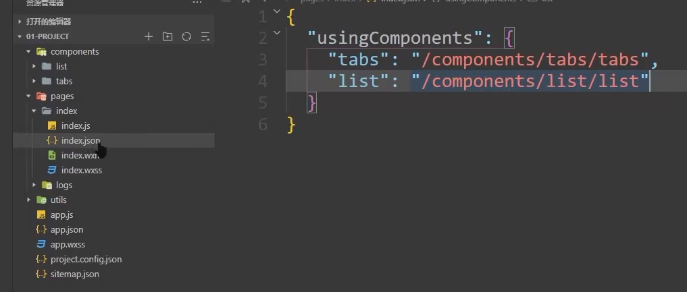
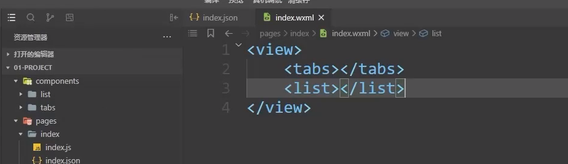
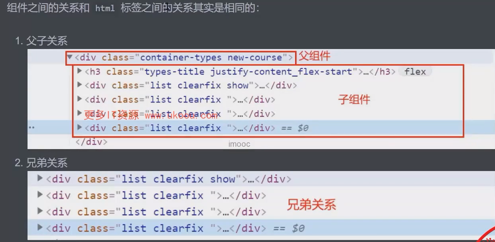

# 小程序进阶概念

## 一、组件化

1、创建组件

1. 创建`components`文件夹
2. 创建`tabs` 和`list`文件夹
3. 右键**新建 `Component`**



2、使用组件

1. 找到页面的`.json`文件

2. 在`usingComponents`选项下注册组件

   1. `key`为当前组件在该页面中的标签名
   2. `value`为组件的代码路径

   

3. 在页面的`wxml`文件中，以注册的`key`为标签名，使用组件



## 二、组件的生命周期

> 1. 组件的生命周期月和方法分别应该被放入到哪个节点下？
> 2. created函数中可以调用月setData吗?
> 3. 获取数据的操作应该在哪个函数中进行？

组件的生命周期应该被定义在`lifetimes`中，而方法必须要放入到`methods` 中。

组件的生命周期一共有三个：

1. `reated`：组件实例刚刚被创建好。**此时还不能调用`setData`**
2. `attached`：组件完全初始化完毕、进入页面节点树后。**绝大多数初始化工作可以在这个时机进行**
3. `detached`：在组件离开页面节点树后

```javascript
/**
 * 组件的初始化数据
 */
data: {
    // tabs 数据
    listData:[]
},
/**
 * 组件的方法列表
 * PS: 组件中的方法必须定义到methods选项中
 */
 methods: {
     loadTabData() {
         wx.request({
             url: 'https://127.0.0.1/api/hot/tabs',
             success: (res) => {
                 this.setData({
                     listData:res.data.data.list
                 })
             }
         })
     }
 }
/**
 * 生命周期函数列表
 */
lifetimes: {
    /**
     * 组件完全初始化完毕，进入页面节点树后
     */
    attached () {
        this.loadTabsData()
    }
}
```

页面实现：

```html
<scroll-view class="tabs-box" scroll-x>
	<view wx:for="{{ listData }}" wx:key="index">
		{{ item.label }}
    </view>
</scroll-view>
```

## 三、数据监听器

通过接口文档我们可以看出，如果想要获取`list`那么我们需要传递一个`type`的参数，而这个`type`就是用户选中的`tab`项的`id`

所以接下来我们就需要来做一件事情：监听用户选中的`tab`，根据用户选中的`tab`来切换底部`list`的数据

> 1. 小程序中通过哪人选项来声明数据监听器？
> 2. 数据监听器的使用场景是什么？

自标：**监听用户选中的`tab`，根据用户选中的`tab`来切换底部`list`的数据**

当我们面临一个复杂的需求时，我们需要把复杂的需求，拆解为几个可热行的步骤

大家看到这里，可以先思考一下，我们如何拆解以上需求...

**步骤拆解如下：**

1. 监听用户选中项的变化
2. 获取用户选中的数据的`id`
3. 把`id`传递给`list` 组件
4. `list`组件根据接收到的`id`获取对应的数据

给选中的tab 添加添加事件

```html
<view wx:for="{{ listData }}" wx:key="index" bindtap="onItemClick" data-index="{{ index }}">
		{{ item.label }}
</view>
```

```javascript
methods: {
    /**
     * 监听用户选中项的变化
     */
    onItemClick (){
        // 1、 用户选中端的下标
        const { index } = e.target.dataset
        // 2、修改选中项
        this.setData({
            active: index
        })
    }
},
/**
 * 数据监听器：observers
 */
observers: {
    // key：要监听的数据
    // value：数据变化时，调用的函数
    active: function (val) {
        // val：变化之后的值
        // 获取用户选中的数据的id
        const {id} = this.data.listData[val]
    }
}
```

## 四、组件之间的关系与通讯



**不同关系之间的传递数据方式：**

### 1、父子组件

**父向子传参**

```javascript
/**
 * 子组件：通过properties声明要从父组件中接收的数据
 * 组件的属性列表
 */
properties: {
    tabId: String
}

// 父组件：通过自定义属性的形式传递数据，以子组件中定义的key为属性名，以要传递的数据为属性值
<list tabId="{{tabSelectId}}">
```

**子向父传参**

```javascript
// 子组件：通过triggerEvent方法发送一个通知，通知父组件接收数据。
// 方法的第一个参数为：通知名
// 方法的第二个参数为：要传递的数据
this.triggerEevent('change', {
    id
})

// 父组件：通过bind监听子组件中发送的通知
// bind后的内容为子组件发送的通知名，表达式为接收到该通知时所触发的方法
<tabs bind:change="onTabChange"></tabs>

// 方法被触发后可以通过e.detail 的形式获取子组件传递过来的数据对象
onTabChange (e) {
    const {id} = e.detail;
    this.setData({
        tabSelectId: id
    })
}
```

### 2、兄弟组件

兄弟组件之间传参：**兄弟关系相当于没有关系**。兄弟组件只是为了方便称呼的一个叫法而已。

所以想要完成兄弟组件之间的传参，就需要：为它们建立关系

而建立关系说白了就是为了找到一个：和这两个组件都认识的”中间人“。

这个中间人一般为：**统一的父组件。**

而最后：兄弟组件之间想要传递数据，就需要利用”中间人进行传递“，也就是

1. 【兄弟A组件）传递数据给父组件（中间人）
2. 父组件（中间人）再把数据传递给【兄弟B组件】

**示例代码**

子组件 tabs 中传递参数给父组件

```javascript
/**
 * 数据监听器：observers
 */
observers: {
    // key：要监听的数据
    // value：数据变化时，调用的函数
    active: function (val) {
        // val：变化之后的值
        // 获取用户选中的数据的id
        const {id} = this.data.listData[val]
        // 把 id 传递给 list 组件
        this.triggerEvent('change',{
            // id:id，在ES6中，如果key和value相同时可以简写
            id
        })
    }
}
```

父组件中监听事件

```html
<tabs bind:change="onTabChange"></tabs>
```

```javascript
data: {
    tabSelectId: ''
},
onTabChange (e) {
    const { id } = e.detail;
    // 传递内容到 list 组件
    this.setData({
        tabSelectId: id
    })
}
```

父组件内容传递到 list 子组件

```html
<list tabId="{{ tabSelectId }}"></list>
```

list 组建中处理传递的值

```javascript
Component({
    // 组件的属性列表
    properties: {
        tabId: String
    },
    // 组件的初始数据
    data: {
        listData: []
    },
    // 组件的方法列表
    methods: {
        // 数据请求方法
        loadListData() {
            wx.request({
                url: 'https:127.0.0.1/api/hot/list',
                data: {
                    // this.data 访问properties中的数据
                    type: this.data.tabId
                },
                success: (res) => {
                    this.setData = ({
                        listData: res.data.data.list
                    })
                }
            })
        }
    },
    // 数据监听器
    observers: {
        tabId: function (val){
            if(!val) return;
            // 数据请求
            this.loadListData()
        }
    }
})
```

## 五、组件的插槽

一个额外的要求：具体展示的文本和样式，我需要在父组件中指定。

因为，组件可以进行复用，当`list`组件应用到`index`时，我们展示的文本和样式，并不一定会在其他页面时想要展示的文本和样式。所以这个文本和样式不可以在`list`中写死。

那么要实现这个功能就需要使用到插槽的识了，

> 1. 什么时候需要使用插槽？
> 2. 小程序中如何定义多个插槽？

### 1、定义

**1.1、定义单一插槽：**

在组件中使用 `slot` 组件定义插槽。

表示：占据了这一块空间，等待父组件填充

**示例代码**

```html
<slot></slot>
```


**1.2、定义多个插槽：**

小程序默认只能定义一个插槽，如果要定义多个插槽那么需要：在组件的js文件中指定`options`选项的`multipleslots`选项为`true`

```javascript
Component({
    options: {
        // 在当前组件中开起了多个插槽
        multipleSlots: true
    },
    methods: {
        ...
    }
})
```

然后通过`slot`的 `name`属性为插槽命名。

```html
<slot name="header"></slot>
<slot name="footer"></slot>
```

### 2、使用

**2.1、单一插槽**

父组件中使用方法，以`innerHTML`的形式插入内容

```html
<component>
    <view>单一插槽插入的 DOM</view>
</component>

<list tabId="{{ tabSelectId }}">
    <view>这是我在 index 页面中放入的view</view>
</list>
```

**2.2、多个插槽**

在组件使用时，以`innerHTML`的形式插入内容，以`slot`属性标记当前DOM插入到哪个插槽中

```html
<component>
    <view slot="header">该元素将被插入到name=header的插槽中</view>
    <view slot="footer">该元素将被插入到name=footer的插槽中</view>
</component>
```

