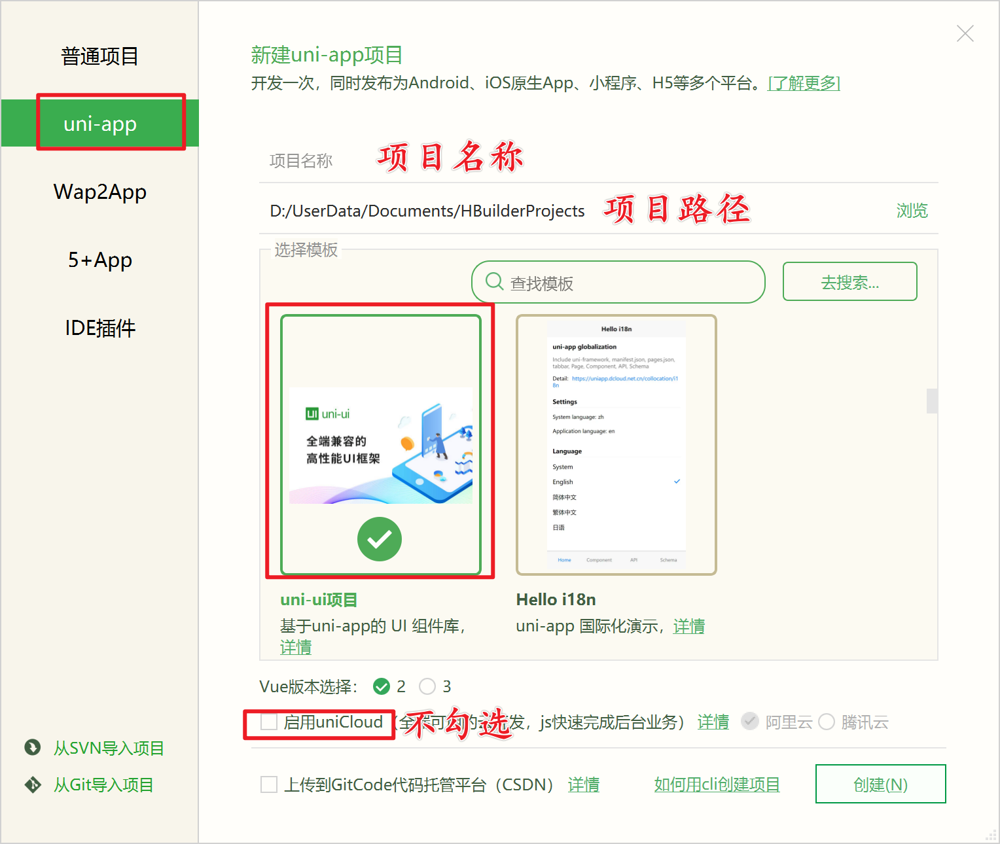

# uniapp开发

## 一、配置开发环境

1、下载安装开发工具HbuildX

2、安装sass依赖

## 二、创建项目

1、创建项目


2、配置信息



### 项目目录介绍

```javascript
│  App.vue // 应用配置文件，用来配置全局样式、生命周期函数等，等同于微信小程序中的app.js
│  index.html // 首页
│  main.js // 项目入口文件
│  manifest.json // 配置应用名称、appid、logo、版本等信息
│  pages.json // 配置页面路径、窗口样式、tabBar等页面类信息
│  uni.scss // uni-app内置的常用样式变量
│  
├─pages // 页面存放文件夹，等同于 微信小程序中的pages
│  └─index // 默认生成的页面
├─static // 静态资源存放文件夹
└─uni_modules // uni-app组件目录
```

### 运行项目到微信开发者工具

1、点击【工具-设置】


2、配置微信开发者工具路径


3、一定要在 `Hbuild X` 中双击打开项目中某个文件（比如 `App.vue`），否则不知道运行哪个项目

4、运行到微信开发者工具


### 使用vscode开发uniapp

1. 使用`VSCode`打开项目
2. 在`VSCode`中安装插件：
   + `uni-helper`：让开发者在`VSCode`中开发`uni-*`的体验尽可能好。
   + `uni-app-snippets`：支持`uni-app`基本能力的代码片段，包括组件和API
   + `uni-app-schemas`：支持`uni-apppages.json`和`manifest.json`简单的格式校验
   + `uni-ui-snippets`：支持`uni-ui`组件代码片段

3. 在`VSCode`中修改代码，运行结果自动发生变化

## 三、创建与配置tabbar

### 创建页面

1、删除`pages`下的`index`文件夹

2、在`pages`文件夹处，右键->选择新建页面

3、确认新建页面的信息


4、点击创建按钮完成新建

5、循环以上顺序，依次完成`hot、hot-video、my`三个页面的创建

### 配置pages.json

1、删除`index`路径

2、新建`tabbar`节点

3、复制资源文件夹下`tab-icons`文件夹到`static`文件夹中