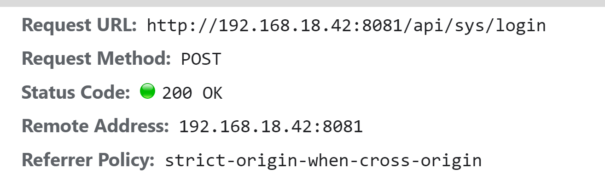
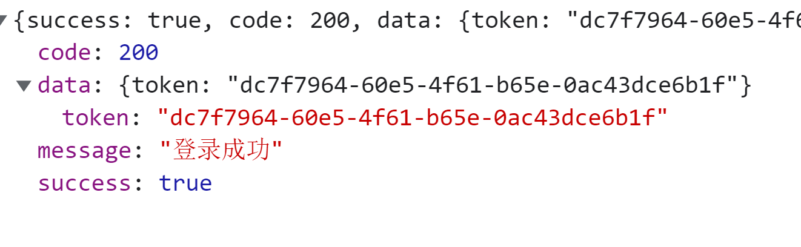

处理完了表单的基本操作之后，接下来就是登录操作的实现了。

对于登录操作在后台项目中是一个通用的解决方案，具体可以分为以下几点：

1. 封装 `axios` 模块
2. 封装 接口请求 模块
3. 封装登录请求动作
4. 保存服务端返回的 `token`
5. 登录鉴权

这些内容就共同的组成了一套 **后台登录解决方案** 。那么在后面的章节中，我们就分别来去处理这些内容。

## 配置环境变量封装 axios 模块

首先我们先去完成第一步：封装 `axios` 模块。

在当前这个场景下，我们希望封装出来的 `axios` 模块，至少需要具备一种能力，那就是：**根据当前模式的不同，设定不同的 `BaseUrl`** ，因为通常情况下企业级项目在 **开发状态** 和 **生产状态** 下它的 `baseUrl` 是不同的。

对于 `@vue/cli` 来说，它具备三种不同的模式：

1. `development`
2. `test`
3. `production`

具体可以点击 [这里](https://cli.vuejs.org/zh/guide/mode-and-env.html#%E6%A8%A1%E5%BC%8F) 进行参考。

根据我们前面所提到的 **开发状态和生产状态** 那么此时我们的 `axios` 必须要满足：**在 开发 || 生产 状态下，可以设定不同 `BaseUrl` 的能力**

那么想要解决这个问题，就必须要使用到 `@vue/cli` 所提供的 [环境变量](https://cli.vuejs.org/zh/guide/mode-and-env.html#%E6%A8%A1%E5%BC%8F) 来去进行实现。

我们可以在项目中创建两个文件：

1. `.env.development`
2. `.env.production`

它们分别对应 **开发状态** 和 **生产状态**。

我们可以在上面两个文件中分别写入以下代码：

**`.env.development`**：

```
# 标志
ENV = 'development'

# base api
VUE_APP_BASE_API = '/api'
```

**`.env.production`：**

```
# 标志
ENV = 'production'

# base api
VUE_APP_BASE_API = '/prod-api'
```

有了这两个文件之后，我们就可以创建对应的 `axios` 模块

创建 `utils/request.js` ，写入如下代码：

```js
import axios from 'axios'

const service = axios.create({
  baseURL: process.env.VUE_APP_BASE_API,
  timeout: 5000
})

export default service
```

## 3-17：封装请求动作

有了 `axios` 模块之后，接下来我们就可以

1. 封装接口请求模块
2. 封装登录请求动作

**封装接口请求模块：**

创建 `api` 文件夹，创建 `sys.js`：

```js
import request from '@/utils/request'

/**
 * 登录
 */
export const login = data => {
  return request({
    url: '/sys/login',
    method: 'POST',
    data
  })
}
```

**封装登录请求动作：**

该动作我们期望把它封装到 `vuex` 的 `action` 中

在 `store` 下创建 `modules` 文件夹，创建 `user.js` 模块，用于处理所有和 **用户相关** 的内容（此处需要使用第三方包 `md5` ）：

```js
import { login } from '@/api/sys'
import md5 from 'md5'
export default {
  namespaced: true,
  state: () => ({}),
  mutations: {},
  actions: {
    login(context, userInfo) {
      const { username, password } = userInfo
      return new Promise((resolve, reject) => {
        login({
          username,
          password: md5(password)
        })
          .then(data => {
            resolve()
          })
          .catch(err => {
            reject(err)
          })
      })
    }
  }
}
```

在 `store/index` 中完成注册：

```js
import { createStore } from 'vuex'
import user from './modules/user.js'
export default createStore({
  modules: {
    user
  }
})
```


## 3-18：登录触发动作

在 `login` 中，触发定义的 `action`

```vue
<template>
	<el-button
        type="primary"
        style="width: 100%; margin-bottom: 30px"
        :loading="loading"
        @click="handleLogin"
        >登录</el-button
      >
</template>
<script setup>
import { ref } from 'vue'
import { validatePassword } from './rules'
import { useStore } from 'vuex'
...

// 登录动作处理
const loading = ref(false)
const loginFromRef = ref(null)
const store = useStore()
const handleLogin = () => {
  loginFromRef.value.validate(valid => {
    if (!valid) return

    loading.value = true
    store
      .dispatch('user/login', loginForm.value)
      .then(() => {
        loading.value = false
        // TODO: 登录后操作
      })
      .catch(err => {
        console.log(err)
        loading.value = false
      })
  })
}
</script>
```

触发之后会得到以下错误：


该错误表示，我们当前请求的接口不存在。

出现这个问题的原因，是因为我们在前面配置环境变量时指定了 **开发环境下**，请求的 `BaseUrl` 为 `/api` ，所以我们真实发出的请求为：`/api/sys/login` 。

这样的一个请求会被自动键入到当前前端所在的服务中，所以我们最终就得到了 `http://192.168.18.42:8081/api/sys/login` 这样的一个请求路径。

而想要处理这个问题，那么可以通过指定 [webpack DevServer 代理](https://webpack.docschina.org/configuration/dev-server/) 的形式，代理当前的 `url` 请求。

而指定这个代理非常简单，是一种近乎固定的配置方案。

在 `vue.config.js` 中，加入以下代码：

```js
module.exports = {
  devServer: {
    // 配置反向代理
    proxy: {
      // 当地址中有/api的时候会触发代理机制
      '/api': {
        // 要代理的服务器地址  这里不用写 api
        target: 'https://api.imooc-admin.lgdsunday.club/',
        changeOrigin: true // 是否跨域
      }
    }
  },
  ...
}

```

重新启动服务，再次进行请求，即可得到返回数据





## 