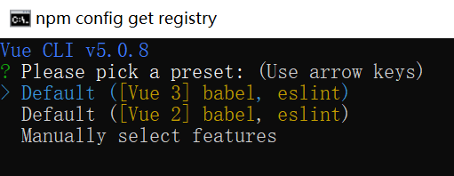

## 一、环境检查

1、环境是否正常

```shell
# 查询Node版本
node -v 
# 查询vue版本
npm info vue
# 查询 vue-cli版本
vue -V 
```


2、如果没有安装`vue-cli`，可以执行下方命令安装`vue-cli`最新版本

```shell
npm install -g @vue/cli
```

如果是旧版本，可以执行下方命令卸载旧版本，然后再安装新版本的脚手架

```shell
npm uninstall vue-cli -g
```

## 二、构建项目

执行下方命令，注意项目名称需要全小写，

```shell
vue create vue3-demo
```

1、在一开始界面，会让我们选择模板，这里我们选择最后一项自定义配置，然后回车。



+ `Default ([Vue 3] babel, eslint)`：默认的 VUE3 模板预设
+ `Default ([Vue 2] babel, eslint)`：默认的 VUE2 模板预设
+ `Manually select features`：自定义手动配置选项

2、然后选择需要的配置项，按上下键移动，空格键选中当前特性，加`*`表示选中，最后按回车确定


+ `Babel`：转码器，可将ES6代码转为ES5
+ `TypeScript`： 使用 TypeScript 
+ `Progressive Web App (PWA) Support` ：使用 PWA（渐进式Web应用程序） 
+ `Router` ：使用 vue-router （路由）
+ `Vuex` ：使用 vuex （状态管理器）
+ `CSS Pre-processors`： 使用 CSS 预处理器
+ `Linter / Formatter `：使用代码风格检查和格式化
+ `Unit Testing`：使用单元测试
+ `E2E Testing`： 使用 E2E 测试（end to end）

3、然后选择`Vue.js`的版本，选择`3.x`，先按空格，再按回车


4、是否用`history`路由模式，这里选择是，输入 Y ，然后回车


5、选择样式的写法，这里使用默认项，直接回车


6、选择代码风格检查选项，我们使用标准配置


7、选择代码检查的时间，我们选择在保存时


8、`Babel、ESLint` 等一些配置是放在`package.json`还是单独的文件里面，选择单独的文件


9、是否需要保存预设，这里选择不保存，输入n，然后回车


接下来等待项目创建完成即可。

10、项目创建完成之后，可以进入到项目文件夹，然后执行下方命令启动项目

```shell
npm run serve
```

