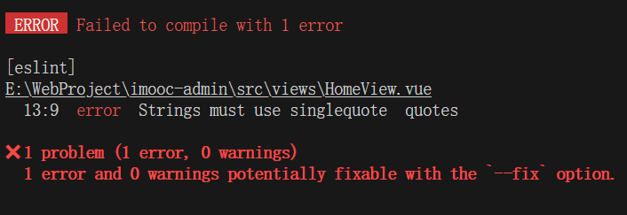
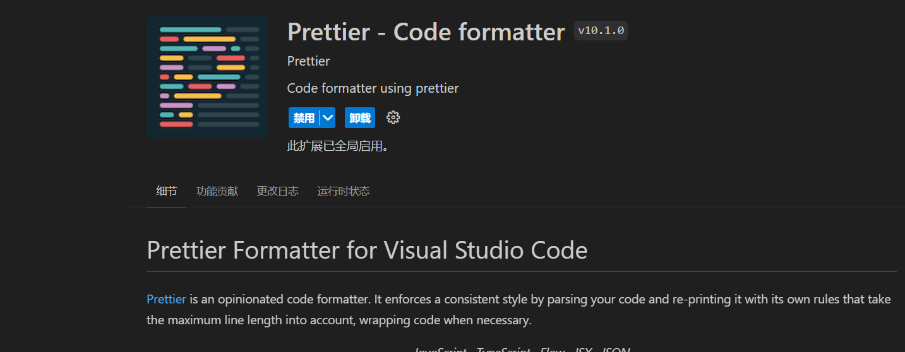
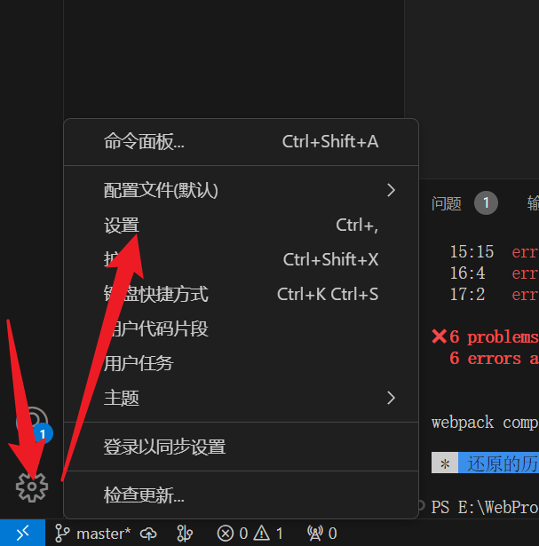
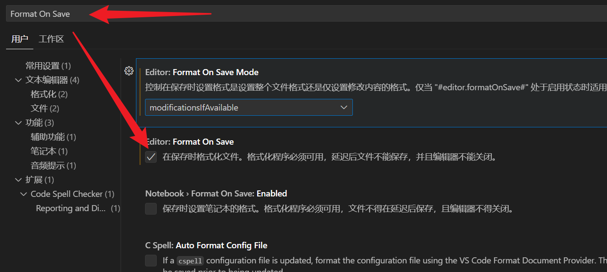
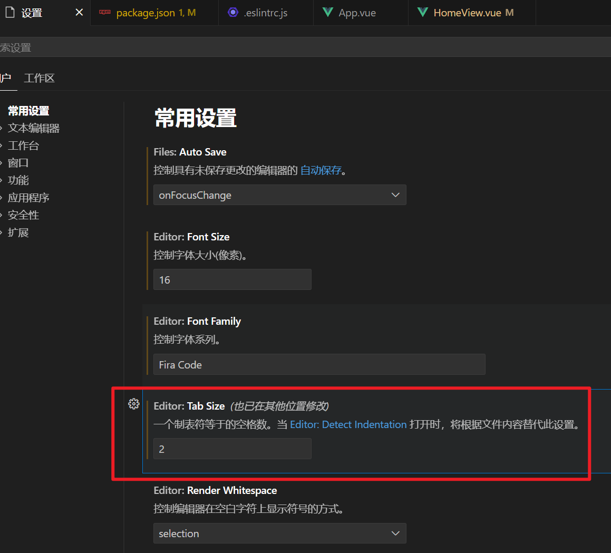
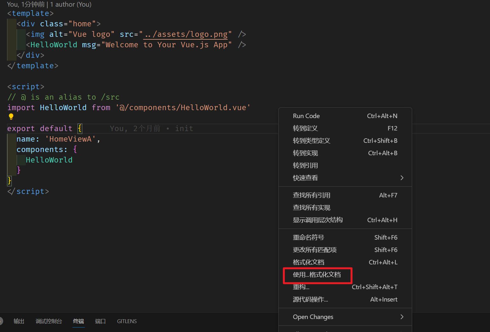
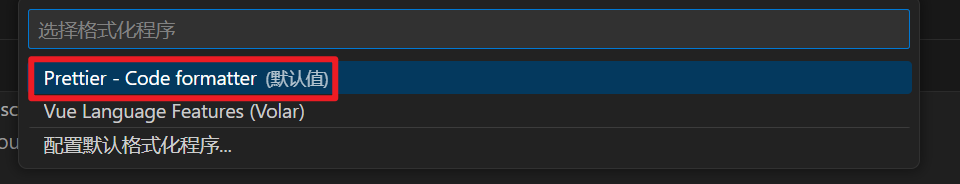
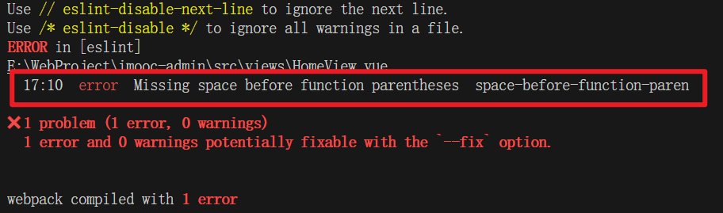
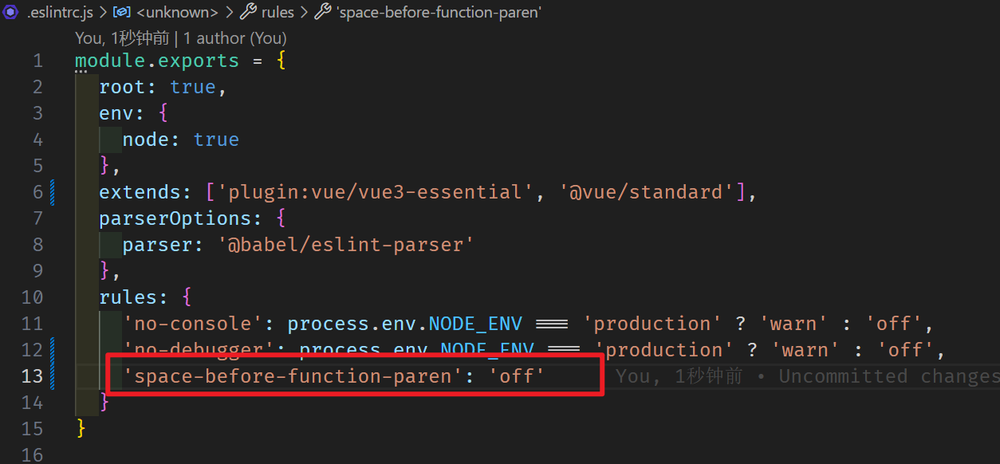

# 代码检测工具 ESLint 

在现代软件开发中，代码质量和一致性是至关重要的。为了确保这些标准，开发者们经常使用各种工具来帮助他们维护代码规范。`ESLint` 就是这样一个强大的工具，它帮助开发者检测和修正 JavaScript 代码中的问题，从而提高代码质量。

## 什么是 ESLint？

`ESLint` 是一个开源的 JavaScript 代码检测工具，自 2013 年 6 月创建以来，它已经成为 JavaScript 开发中不可或缺的一部分。其核心目标是提供一个插件化的代码检测环境，让开发者能够根据自己的需求定制规则，以确保代码的一致性和避免潜在的错误。

## 如何在项目中使用 ESLint？

在许多现代前端框架和库中，如 React、Vue 或 Angular，创建项目时通常会包含一个名为 `.eslintrc.js` 的配置文件。这个文件定义了项目中代码应该遵循的规则。随着开发者对代码质量的重视，`ESLint` 也得到了广泛的应用，许多大型公司甚至在标准规则的基础上进行了扩展。

## 选择 ESLint 规则

在创建项目时，开发者可以选择不同的 `ESLint` 规则集。例如，可以选择仅包含错误预防的基本规则，或者采用 Airbnb 或 Standard 这样的流行规则集。这些规则集提供了一套预定义的最佳实践，帮助开发者遵循一致的编码风格。

```javascript
? Pick a linter / formatter config: 
  ESLint with error prevention only // 仅包含错误的 ESLint
  ESLint + Airbnb config // Airbnb 的 ESLint 延伸规则
  ESLint + Standard config // 标准的 ESLint 规则
```

创建项目的时候选择了 **标准的ESLint规则**，下面是相关配置，我们打开项目中的`.eslintrc.js`文件

```javascript
// ESLint 配置文件遵循 commonJS 的导出规则，所导出的对象就是 ESLint 的配置对象
// 文档：https://eslint.bootcss.com/docs/user-guide/configuring
module.exports = {
  // 表示当前目录即为根目录，ESLint 规则将被限制到该目录下
  root: true,
  // env 表示启用 ESLint 检测的环境
  env: {
    // 在 node 环境下启动 ESLint 检测
    node: true
  },
  // ESLint 中基础配置需要继承的配置
  extends: ["plugin:vue/vue3-essential", "@vue/standard"],
  // 解析器
  parserOptions: {
    parser: "@babel/eslint-parser"
  },
  // 需要修改的启用规则及其各自的错误级别
  /**
   * 错误级别分为三种：
   * "off" 或 0 - 关闭规则
   * "warn" 或 1 - 开启规则，使用警告级别的错误：warn (不会导致程序退出)
   * "error" 或 2 - 开启规则，使用错误级别的错误：error (当被触发的时候，程序会退出)
   */
  rules: {
    "no-console": process.env.NODE_ENV === "production" ? "warn" : "off",
    "no-debugger": process.env.NODE_ENV === "production" ? "warn" : "off"
  }
};

```

那么到这里咱们已经大致的了解了`.eslintrc.js` 文件，基于 `ESLint` 如果我们出现不符合规范的代码格式时，那么就会得到一个对应的错误。

比如：

> 我们可以把 `Home.vue` 中的 `name` 属性值，由单引号改为双引号

此时，只要我们一保存代码，那么就会得到一个对应的错误



这个错误表示： 

1. 此时我们触发了一个 《错误级别的错误》 
2. 触发该错误的位置是 在 `Home.vue` 的第 13 行 第九列 中
3. 错误描述为：字符串必须使用单引号
4. 错误规则为：`quotes`

那么想要解决这个错误，通常情况下我们有两种方式：

1. 按照 `ESLint` 的要求修改代码
2. 修改 `ESLint` 的验证规则

**按照 `ESLint` 的要求修改代码：**

>  在 `Home.vue` 的第 13 行中把双引号改为单引号

**修改 `ESLint` 的验证规则：**

1. 在 `.eslintrc.js` 文件中，新增一条验证规则

   ```json
   "quotes": "error" // 默认
   "quotes": "warn" // 修改为警告
   "quotes": "off" // 修改不校验
   ```

那么这一小节，我们了解了 `vue-cli` 创建 `vue3` 项目时，`Standard config` 的 `ESLint` 配置，并且知道了如何解决 `ESLint` 报错的问题。

但是一个团队中，人员的水平高低不齐，大量的 `ESLint` 规则校验，会让很多的开发者头疼不已，从而大大影响了项目的开发进度。

试想一下，在你去完成项目代码的同时，还需要时时刻刻注意代码的格式问题，这将是一件多么痛苦的事情！

那么有没有什么办法，既可以保证 `ESLint` 规则校验，又可以解决严苛的格式规则导致的影响项目进度的问题呢？

欲知后事如何，请听下一节《`Prettier` ，让你的代码变得更漂亮！》

# 代码格式化 Prettier

## `prettier` 是什么？

1. 一个代码格式化工具
2. 开箱即用
3. 可以直接集成到 `VSCode` 之中
4. 在保存时，让代码直接符合 `ESLint` 标准

那么这些简单配置具体指的是什么呢？

## ESLint 与 Prettier 配合解决代码格式问题

1、在 `VSCode` 中安装 `prettier` 插件（搜索 `prettier`），这个插件可以帮助我们在配置 `prettier` 的时候获得提示



2、在项目中新建 `.prettierrc` 文件，该文件为 `perttier` 默认配置文件，文件内容如下所示

```json
{
  "semi": false,
  "singleQuote": true,
  "trailingComma": "none"
}
```

- `"semi": false`：不尾随分号
- `"singleQuote": true`：使用单引号
- `"trailingComma": "none"`：多行逗号分割的语法中，最后一行不加逗号

3、打开 `VSCode` 设置



4、在设置中，搜索 `save` ，勾选 `Format On Save`



5、着这里`Format On Save Mode`有三种方式，默认是对整个文件进行格式化，我们可以根据自己的需求选择不同的模式，我这里选择`modificationslfAvailable`。

- `file`：设置整个文件的格式。
- `modifications`：格式修改(需要源代码管理)
- `modificationsIfAvailable`：将尝试只对修改进行格式化需要源代码管理）。如果无法使用源代码管理，则将格式化整个文件。

至此，你即可在 **`VSCode` 保存时，自动格式化代码！**

# 其他问题

一、VSCode 而言，默认一个 tab 等于 4 个空格，而 ESLint 希望一个 tab 为两个空格

打开设置界面，找到`Tab Size`，修改值为`2`



二、如果 VSCode 中存在多个代码格式化工具，出现格式化冲突的问题

1、此时在代码编辑区点击鼠标右键，然后选择【使用…格式化文档】



2、在上方弹出框中选择`Prettier `



三、ESLint 和 prettier 之间的冲突问题，比如方法名和后面的括号之间的空格问题。ESLint 规则是添加空格，Prettier则是不添加空格



此时可以考虑在ESlint配置文件中关闭相关检测规则。

1、打开 `.eslintrc.js` 配置文件

2、在 `rules` 规则下，新增一条规则

```json
'space-before-function-paren': 'off'
```

3、重启项目



