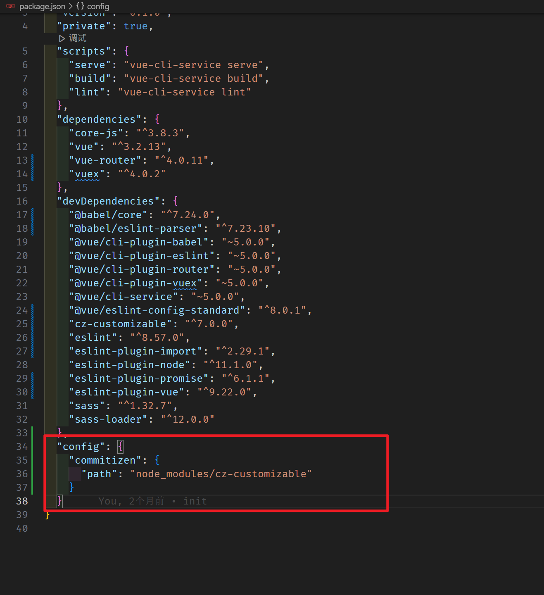

## 约定式提交规范

咱们今天就以目前使用较多的 [Angular团队规范](https://github.com/angular/angular.js/blob/master/DEVELOPERS.md#-git-commit-guidelines) 延伸出的 [Conventional Commits specification（约定式提交）](https://www.conventionalcommits.org/zh-hans/v1.0.0/) 为例，来为大家详解  **`git` 提交规范**

约定式提交规范要求如下：

```js
<type>[optional scope]: <description>

[optional body]

[optional footer(s)]

--------  翻译 -------------
    
<类型>[可选 范围]: <描述>

[可选 正文]

[可选 脚注]
```

其中 `<type>` 类型，必须是一个可选的值，比如：

1. 新功能：`feat`
2. 修复：`fix`
3. 文档变更：`docs`
4. ....

也就是说，如果要按照 **约定式提交规范** 来去做的化，那么你的一次提交描述应该式这个样子的：

```
docs[登录授权]:修改了登录授权的文档

将文档中的公司授权修改为企业授权

第188个ISSUE
```

## Commitizen

如果严格安装 **约定式提交规范**， 来手动进行代码提交的话，那么是一件非常痛苦的事情，但是 **git 提交规范的处理** 又势在必行，那么怎么办呢？

经过了很多人的冥思苦想，就出现了一种叫做 **git 提交规范化工具** 的东西，而我们要学习的 `commitizen` 就是其中的佼佼者！

`commitizen` 仓库名为 [cz-cli](https://github.com/commitizen/cz-cli) ，它提供了一个 `git cz` 的指令用于代替 `git commit`，简单一句话介绍它：

> 当你使用 `commitizen` 进行代码提交（git commit）时，`commitizen` 会提交你在提交时填写所有必需的提交字段！

### 使用步骤

1、全局安装`Commitizen`

```bash
npm install -g commitizen
```

2、安装并配置 `cz-customizable` 插件

1. 使用 `npm` 下载 `cz-customizable`

   ```node
   npm i cz-customizable --save-dev
   ```

2. 添加以下配置到 `package.json ` 中

   ```json
   ...
     "config": {
       "commitizen": {
         "path": "node_modules/cz-customizable"
       }
     }
   ```




3、项目根目录下创建 `.cz-config.js` 自定义提示文件

   ```js
   module.exports = {
     // 可选类型
     types: [
       { value: 'feat', name: 'feat:     新功能' },
       { value: 'fix', name: 'fix:      修复' },
       { value: 'docs', name: 'docs:     文档变更' },
       { value: 'style', name: 'style:    代码格式(不影响代码运行的变动)' },
       {
         value: 'refactor',
         name: 'refactor: 重构(既不是增加feature，也不是修复bug)'
       },
       { value: 'perf', name: 'perf:     性能优化' },
       { value: 'test', name: 'test:     增加测试' },
       { value: 'chore', name: 'chore:    构建过程或辅助工具的变动' },
       { value: 'revert', name: 'revert:   回退' },
       { value: 'build', name: 'build:    打包' }
     ],
     // 消息步骤
     messages: {
       type: '请选择提交类型:',
       customScope: '请输入修改范围(可选):',
       subject: '请简要描述提交(必填):',
       body: '请输入详细描述(可选):',
       footer: '请输入要关闭的issue(可选):',
       confirmCommit: '确认使用以上信息提交？(y/n/e/h)'
     },
     // 跳过步骤
     skipQuestions: ['body', 'footer'],
     // subject文字长度默认是72
     subjectLimit: 72
   }
   ```

4、使用 `git cz` 代替 `git commit`，即可看到提示内容

那么到这里我们就已经可以使用`git cz` 来代替了 `git commit` 实现了规范化的提交诉求了，但是当前依然存在着一个问题，那就是我们必须要通过 `git cz` 指令才可以完成规范化提交！

那么如果有马虎的同事，它们忘记了使用 `git cz` 指令，直接就提交了怎么办呢？

那么有没有方式来限制这种错误的出现呢？

答案是有的！

下一节我们来看 《什么是 Git Hooks》