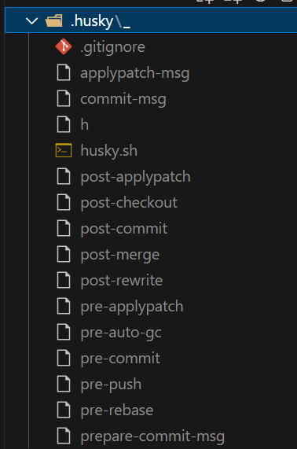
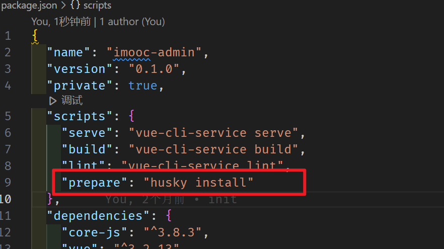
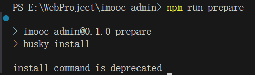
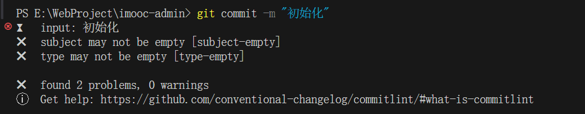

# 什么是 Git Hooks

先来明确一下我们最终要实现的效果：

> 我们希望：
>
> 当《提交描述信息》不符合 [约定式提交规范](https://www.conventionalcommits.org/zh-hans/v1.0.0/) 的时候，阻止当前的提交，并抛出对应的错误提示

而要实现这个目的，我们就需要先来了解一个概念，叫做 `Git hooks（git 钩子 || git 回调方法）` 

也就是：**`git` 在执行某个事件之前或之后进行一些其他额外的操作**

而我们所期望的 **阻止不合规的提交消息**，那么就需要使用到 `hooks` 的钩子函数。

下面是我整理出来的所有的 `hooks` ，大家可以进行一下参考，其中加粗的是常用到的 `hooks`：

| Git Hook              | 调用时机                                                     | 说明                                                         |
| :-------------------- | ------------------------------------------------------------ | ------------------------------------------------------------ |
| pre-applypatch        | `git am`执行前                                               |                                                              |
| applypatch-msg        | `git am`执行前                                               |                                                              |
| post-applypatch       | `git am`执行后                                               | 不影响`git am`的结果                                         |
| **pre-commit**        | `git commit`执行前                                           | 可以用`git commit --no-verify`绕过                           |
| **commit-msg**        | `git commit`执行前                                           | 可以用`git commit --no-verify`绕过                           |
| post-commit           | `git commit`执行后                                           | 不影响`git commit`的结果                                     |
| pre-merge-commit      | `git merge`执行前                                            | 可以用`git merge --no-verify`绕过。                          |
| prepare-commit-msg    | `git commit`执行后，编辑器打开之前                           |                                                              |
| pre-rebase            | `git rebase`执行前                                           |                                                              |
| post-checkout         | `git checkout`或`git switch`执行后                           | 如果不使用`--no-checkout`参数，则在`git clone`之后也会执行。 |
| post-merge            | `git commit`执行后                                           | 在执行`git pull`时也会被调用                                 |
| pre-push              | `git push`执行前                                             |                                                              |
| pre-receive           | `git-receive-pack`执行前                                     |                                                              |
| update                |                                                              |                                                              |
| post-receive          | `git-receive-pack`执行后                                     | 不影响`git-receive-pack`的结果                               |
| post-update           | 当 `git-receive-pack`对 `git push` 作出反应并更新仓库中的引用时 |                                                              |
| push-to-checkout      | 当``git-receive-pack`对`git push`做出反应并更新仓库中的引用时，以及当推送试图更新当前被签出的分支且`receive.denyCurrentBranch`配置被设置为`updateInstead`时 |                                                              |
| pre-auto-gc           | `git gc --auto`执行前                                        |                                                              |
| post-rewrite          | 执行`git commit --amend`或`git rebase`时                     |                                                              |
| sendemail-validate    | `git send-email`执行前                                       |                                                              |
| fsmonitor-watchman    | 配置`core.fsmonitor`被设置为`.git/hooks/fsmonitor-watchman`或`.git/hooks/fsmonitor-watchmanv2`时 |                                                              |
| p4-pre-submit         | `git-p4 submit`执行前                                        | 可以用`git-p4 submit --no-verify`绕过                        |
| p4-prepare-changelist | `git-p4 submit`执行后，编辑器启动前                          | 可以用`git-p4 submit --no-verify`绕过                        |
| p4-changelist         | `git-p4 submit`执行并编辑完`changelist message`后            | 可以用`git-p4 submit --no-verify`绕过                        |
| p4-post-changelist    | `git-p4 submit`执行后                                        |                                                              |
| post-index-change     | 索引被写入到`read-cache.c do_write_locked_index`后           |                                                              |

PS：详细的 `HOOKS介绍` 可点击[这里](https://git-scm.com/docs/githooks)查看

整体的 `hooks` 非常多，当时我们其中用的比较多的其实只有两个：

| Git Hook       | 调用时机                                                     | 说明                               |
| :------------- | ------------------------------------------------------------ | ---------------------------------- |
| **pre-commit** | `git commit`执行前<br />它不接受任何参数，并且在获取提交日志消息并进行提交之前被调用。脚本`git commit`以非零状态退出会导致命令在创建提交之前中止。 | 可以用`git commit --no-verify`绕过 |
| **commit-msg** | `git commit`执行前<br />可用于将消息规范化为某种项目标准格式。<br />还可用于在检查消息文件后拒绝提交。 | 可以用`git commit --no-verify`绕过 |

简单来说这两个钩子：

1. `commit-msg`：可以用来规范化标准格式，并且可以按需指定是否要拒绝本次提交
2. `pre-commit`：会在提交前被调用，并且可以按需指定是否要拒绝本次提交

# 使用 husky + commitlint 检查提交描述是否符合规范要求

我们了解了 `git hooks` 的概念，那么接下来我们就使用 `git hooks` 来去校验我们的提交信息。

要完成这么个目标，那么我们需要使用两个工具：

1. [commitlint](https://github.com/conventional-changelog/commitlint)：用于检查提交信息

2. [husky](https://github.com/typicode/husky)：是`git hooks`工具

注意：**`npm` 需要在 7.x 以上版本！！！！！**

那么下面我们分别来去安装一下这两个工具：

## commitlint

1、安装依赖：

```bash
npm install --save-dev @commitlint/config-conventional @commitlint/cli
```

2、创建 `commitlint.config.js` 文件，写入如下内容

```javascript
module.exports = {extends: ['@commitlint/config-conventional']}
```

3、打开 `commitlint.config.js` ， 增加配置项（ [config-conventional 默认配置点击可查看](https://github.com/conventional-changelog/commitlint/blob/master/@commitlint/config-conventional/index.js) ）：

```javascript
module.exports = {
  // 继承的规则
  extends: ['@commitlint/config-conventional'],
  // 定义规则类型
  rules: {
    // type 类型定义，表示 git 提交的 type 必须在以下类型范围内
    'type-enum': [
      // 大年验证的错误级别，2-表示错误级别的错误
      2,
      // 在什么情况下验证，always表示在任何情况下
      'always',
      // 泛型内容
      [
        'feat', // 新功能 feature
        'fix', // 修复 bug
        'docs', // 文档注释
        'style', // 代码格式(不影响代码运行的变动)
        'refactor', // 重构(既不增加新功能，也不是修复bug)
        'perf', // 性能优化
        'test', // 增加测试
        'chore', // 构建过程或辅助工具的变动
        'revert', // 回退
        'build' // 打包
      ]
    ],
    // subject 大小写不做校验
    'subject-case': [0]
  }
}
```

**注意：确保保存为 `UTF-8` 的编码格式**，否则可能会出现错误

## husky

1、安装依赖：

```bash
npm install husky --save-dev
```

2、启动 `hooks` ， 生成 `.husky` 文件夹

```bash
npx husky install
```



3、在 `package.json` 中添加 `prepare` 指令

```bash
npm pkg set scripts.prepare="husky install"
```



4、执行 `prepare` 指令

```bas
npm run prepare
```

5、执行成功，提示



6、添加 `commitlint` 的 `hook` 到 `husky`中，修改 `.husky/commit-msg` 文件中，修改后的内容如下所示：

```bash
#!/usr/bin/env sh
npx --no-install commitlint --edit "$1"
```

7、此时， 不符合规范的 commit 将不再可提交：



那么至此，我们就已经可以处理好了 **强制规范化的提交要求**，到现在 **不符合规范的提交信息，将不可在被提交！**

那么到这里我们的 **规范化目标** 就完成了吗？

当然没有！

现在我们还缺少一个 **规范化的处理** ，那就是 **代码格式提交规范处理！**

有同学看到这里可能说，咦！ 这个怎么看着这么眼熟啊？这个事情我们之前不是做过了吗？还需要在处理什么？

欲知后事如何，请看下一节《通过 pre-commit 处理提交时代码规范》