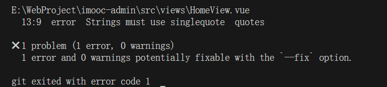

# 需求背景

我们通常会引入`ESLint`和`Prettier`这样的工具来帮助我们规范本地代码的格式。然而，这种格式化过程仅在本地有效，并且依赖于我们在`VSCode`中手动设置自动保存功能。如果团队成员忘记进行这样的配置，或者在没有格式化的情况下提交了代码，我们该如何确保代码质量呢？

# 解决方案

为了解决这一潜在的风险，我们需要一种更为自动化的解决方案。这时，`husky`就派上了用场。`husky`是一个强大的工具，它可以在代码提交之前自动执行一系列检查。通过配置`husky`来监听`pre-commit`钩子，我们可以在提交前自动运行`npx eslint --ext .js,.vue src`命令，对代码进行格式化和质量检查。这样，无论何时，只要有人尝试提交代码，`husky`都会确保代码符合我们设定的标准，从而维护整个项目的代码质量。

1、修改 `.husky/pre-commit` 文件，修改后的内容如下所示

```bash
#!/usr/bin/env sh
npx eslint --ext .js,.vue src
```

2、关闭 `VSCode` 的自动保存操作

3、修改一处代码，使其不符合 `ESLint` 校验规则

4、执行 **提交操作** 会发现，抛出相关代码规范检查错误，无法提交代码

