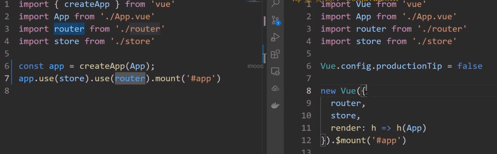
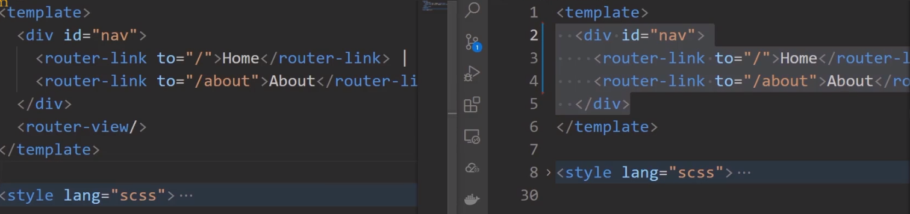
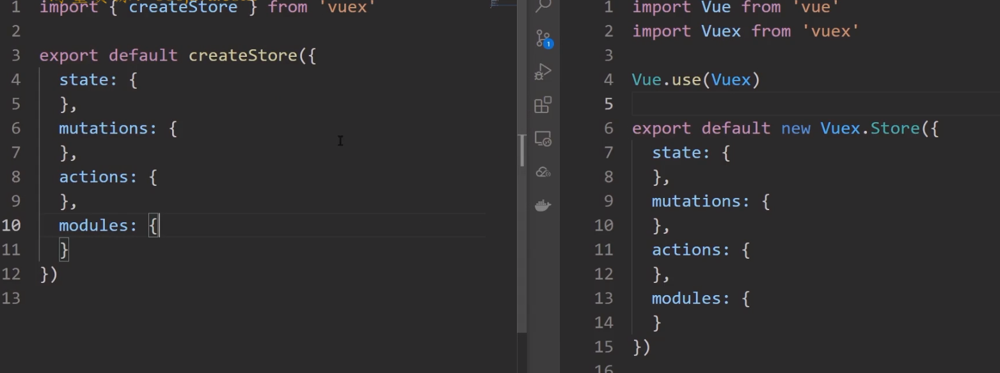
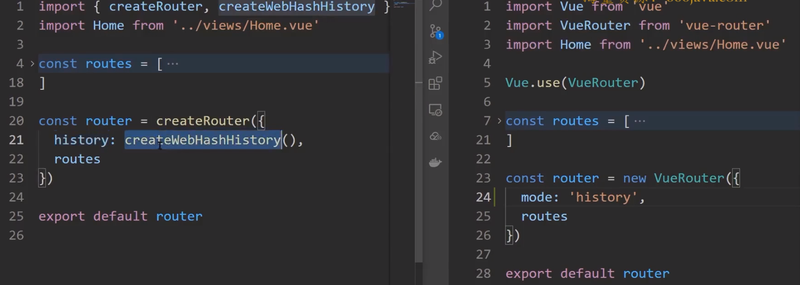
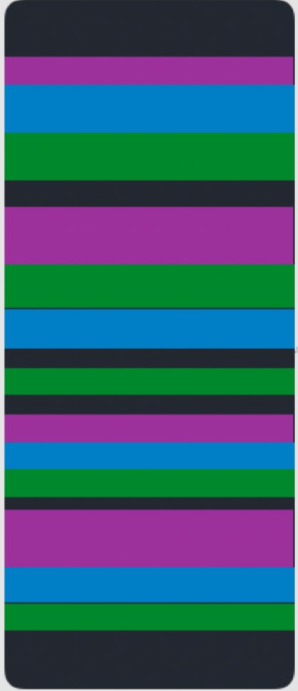
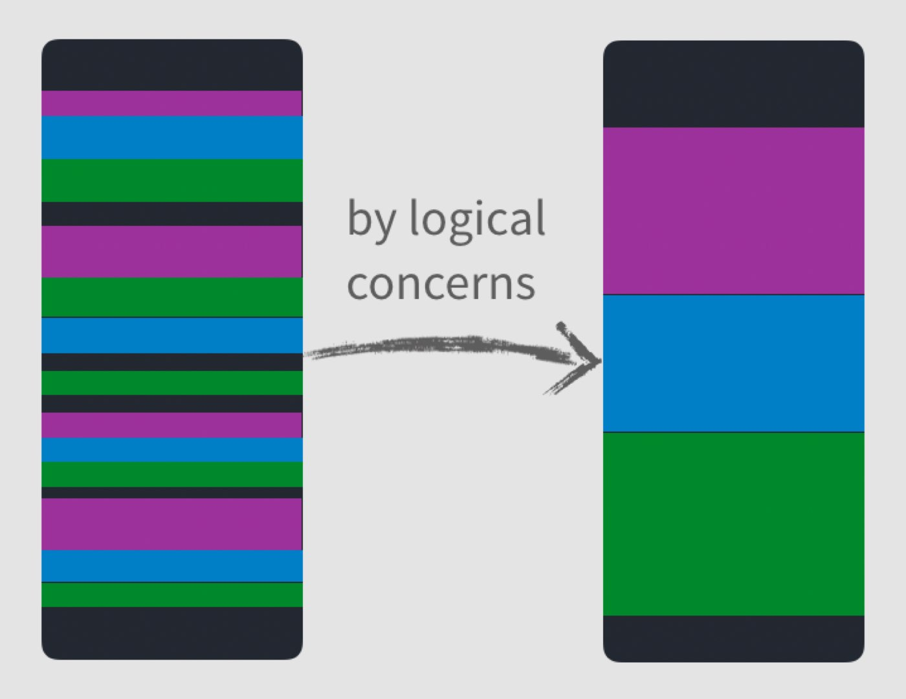

# VUE3项目结构变化

在 `vue3` 的初始化项目中，与 `vue2` 对比的最大差异其实就是两点

1. `vue3` 使用 **按需导入的形式** 进行初始化操作
2. `<template>` 标签中支持多个根标签

文件差异如下所示：

1、`main.js`

1. 通过 **按需导入**的 `createApp` 方法来来构建 `vue` 实例
2. 通过 `vue实例.use` 方法来挂载插件（`router`、`vuex`）
3. 没有了 `Vue` 构造方法，无法再挂载原型



2、`App.vue`

1. 组件内部结构无变化，依然是

   1. `tempalte`
   2. `script`
   3. `style`

2. `<template>` 标签中支持多个根标签



3、`store/index.js`

1. 通过 **按需导入**的 `createStore` 方法来来构建 `store` 实例
2. 无需再通过 `Vue.use(Vuex)` 的形式进行挂载



4、`router/index.js`

1. 通过 **按需导入**的 `createRouter` 方法来构建 `router` 实例
2. 通过 **按需导入**的 `createWebHashHistory` 方法来创建 **`hash` 模式对象**，进行路由模式指定
3. 无需再通过 `Vue.use(VueRouter)` 的形式进行挂载
4. `routes` 路由表的定义无差别



## 初始化项目

使用vue-cli生成的代码会有一些冗余，我们去除不需要的部分，主要修改如下所示：

1、`App.vue` 代码修改后如下：

```vue
<template>
  <router-view />
</template>

<style lang="scss"></style>
```

2、`router/index.js` 修改后的代码如下所示：

```javascript
import { createRouter, createWebHashHistory } from 'vue-router'

const routes = []

const router = createRouter({
  history: createWebHashHistory(),
  routes
})

export default router
```

3、删除 `views` 文件夹下的所有 `.vue` 文件 

4、删除 `components` 文件夹下的所有 `.vue` 文件

# VUE3新特性

`vue3` 中到底新增了哪些比较核心的东西呢？：

1. `composition API`
2. 使用了 `Proxy` 代替 `Object.defineProperty()` 实现响应式
3. 全新的全家桶
4. 全新的 `TS` 支持
5. `vite`

### Composition API：组合式 API

想要了解 **组合式 API**，那么首先我们需要先了解 `options API`，也就是 `vue2` 中的开发形式。

`vue2` 中的开发形式被称为 `options API`，`options API` 存在

- 方便
- 易学
- 清晰

等一些特点，但是也存在着一些问题。

而其中最主要的一个问题就是：**当你的组件变得越来越复杂时，组件的可读性会变得越来越差。**

不知道大家有没有遇到过一种情况，那就是：**你在完成一个组件代码时，总是需要不停的上下滚动滚轮，来查看 `data` 、`methods`、`computed` 之间的配合使用，就像下面一样**

在这个动图中我们定义的两个数据 `optionsData` 和 `selectOption`，然后我们在多个方法中都使用到了它们，但是大家可以发现，我们在使用或查看的过程中，得一直不停的翻动页面！

因为我们的整体组件代码结构是这样的：



**定义数据与使用数据被分割在组件的各个位置，导致我们需要不断地翻滚页面来查看具体的业务逻辑！**

并且这种现象随着组件越来越复杂，这种情况会变得越来越严重！

而这个就是 `options API` 所存在的问题：**当你的组件变得越来越复杂时，组件的可读性会变得越来越差。**

而 `Composition API` 所期望解决的就是这么一个问题



**把定义数据与使用数据的逻辑放在一起进行处理，以达到更加易读，更加方便扩展的目的！**

那么具体怎么去做的，我们会在后面的课程中通过最新的 `RFC -> script setup` 语法为大家进行解读。 

### 使用了 `Proxy` 代替 `Object.defineProperty()` 实现响应式

在 [vue 2 的文档中](https://cn.vuejs.org/v2/guide/reactivity.html#%E6%A3%80%E6%B5%8B%E5%8F%98%E5%8C%96%E7%9A%84%E6%B3%A8%E6%84%8F%E4%BA%8B%E9%A1%B9) 有这么一段话：

> 由于 JavaScript 的限制，Vue **不能检测**数组和对象的变化。

这里所谓的 **`JavaScript` 的限制**，所指的就是 [Object.defineProperty()](https://developer.mozilla.org/zh-CN/docs/Web/JavaScript/Reference/Global_Objects/Object/defineProperty) 的限制。

因为 [Object.defineProperty()](https://developer.mozilla.org/zh-CN/docs/Web/JavaScript/Reference/Global_Objects/Object/defineProperty) 是通过：**为对象属性指定描述符** 的方式来监听 **对象中某个属性的 `get` 和 `set`**。

所以在以下两种情况下，新的属性是 **非响应式的**：

1. [对于对象](https://cn.vuejs.org/v2/guide/reactivity.html#对于对象)：

   ```js
   var vm = new Vue({
     data:{
       a:1
     }
   })
   
   // `vm.a` 是响应式的
   
   vm.b = 2
   // `vm.b` 是非响应式的
   ```

   

2. [对于数组](https://cn.vuejs.org/v2/guide/reactivity.html#对于数组)：

   ```js
   var vm = new Vue({
     data: {
       items: ['a', 'b', 'c']
     }
   })
   vm.items[1] = 'x' // 不是响应性的
   vm.items.length = 2 // 不是响应性的
   ```

这也是为什么会存在 [Vue.set](https://cn.vuejs.org/v2/api/#Vue-set) 这个 `API` 的原因。

但是，这样的一种情况其实一直都是不合理的，因为这只是无意义的增加了复杂度而已，但是一直以来因为  [Object.defineProperty()](https://developer.mozilla.org/zh-CN/docs/Web/JavaScript/Reference/Global_Objects/Object/defineProperty) 这个 `API` 本身的限制，所以一直无法处理。

直到 [Proxy](https://developer.mozilla.org/zh-CN/docs/Web/JavaScript/Reference/Global_Objects/Proxy) 被广泛支持，这种情况才发生了变化。

[Proxy](https://developer.mozilla.org/zh-CN/docs/Web/JavaScript/Reference/Global_Objects/Proxy) 用于：**为对象创建一个代理，从而实现基本操作的拦截。** 那么这样就从根本上解决了 [Object.defineProperty()](https://developer.mozilla.org/zh-CN/docs/Web/JavaScript/Reference/Global_Objects/Object/defineProperty) 所面临的那么两个问题。这也是为什么 `vue3` 中不再有 `Vue.set` 方法的原因。

关于 `proxy` 的详细介绍，大家可以查看这一篇博客 [Vue 3 深入响应式原理 - 聊一聊响应式构建的那些经历](https://www.imooc.com/article/320582)，在视频中，我们就不过多赘述了

### 全新的全家桶

`vue` 被称为是 **渐进式框架**，就是因为，对于 `vue` 而言，它不仅仅只有 `vue.js` 这一个核心库，还有其他的比如 [vue-router](https://next.router.vuejs.org/zh/)，[vuex](https://next.vuex.vuejs.org/zh/index.html) 等一些周边库。这些周边库和 `vue.js` 一起共同组成了 `vue` 。

所以说当 `vue3` 发布之后，`vue-router`、`vuex` 等全家桶也迎来了一波更新。在前面的 **vue3 项目结构解析** 这一小节，大家应该也能看到对应的代码变化。

那么关于全家桶的更新内容，我们会在后面的课程中进行详细的讲解，所以就不在这里进行赘述了。

### 全新的 `TS` 支持

`vue 3` 使用 `TypeScript` 进行了重构，其目的是 **为了防止随着应用的增长，而产生的许多潜在的运行时静态类型的错误** 。同时这也意味着以后在 `vue` 中使用 `TypeScript` 不再需要其他的任何工具。

但是有一点我需要提醒大家，虽然 `vue` 对 `TypeScript` 进行全面支持，这并不代表我们应该在任何情况下都**无条件**的使用 `TypeScript`（后面我们简称 `TypeScript` 为 `TS`）。

`TS` 的优势主要在于 **静态类型检查和环境声明**，但同时它也会为你的项目增加复杂度。如果你的项目需要使用到以上两点，那么我推荐你使用 `TS` 。否则只是增加了无谓的复杂度而已。

**决定我们应该使用哪种技术的唯一条件，就是我们的目标。** 我们需要做的是在可以 **完成目标** 的基础上，寻找最简单的实现方案。

所以，基于以上原因，我们项目中并**没有**使用 `TS` 进行项目的开发。如果在后续的过程中，发现大家有这方面的需要，那么我会考虑专门针对 `TS` 的特性来开发一个对应的项目。

### vite

最后就是一个新的打包工具 [vite](https://cn.vitejs.dev/)，[vite](https://cn.vitejs.dev/) 严格来说不能算是 `vue3` 的内容，只不过它跟随 `vue3` 进行了发布所以我们这里就把它算到了新特性里面。

[vite](https://cn.vitejs.dev/) 的作用其实和 [webpack](https://webpack.docschina.org/) 是一样的，都是一个 **前端构建工具**。它区别于 `webpack` 的地方在于它完全使用了 `ES Module` 的特性，可以无需预先打包，而是采用实时编译的方式。这样让它具备了远高于 `webpack` 的启动速度和热更新速度。

但是 **成也萧何，败也萧何** 因为 `vite` 完全依赖 `ES Module` 就导致了 它无法直接对 `commonJS` 的模块化方式进行支持，必须得采用 [依赖预构建](https://cn.vitejs.dev/guide/dep-pre-bundling.html) 的形式。

目前 `vite` 还不够稳定到足够支持商用，所以如果大家只是想要尝鲜，那么没有问题。如果大家希望创建一个商用的大型项目，那么个人还是推荐更加成熟的 `webpack` 方案。

而我们当前的项目旨在构建一个 **后台前端解决方案系统**，所以我们这里依然选择了 `webpack` ，而不是 `vite`。
