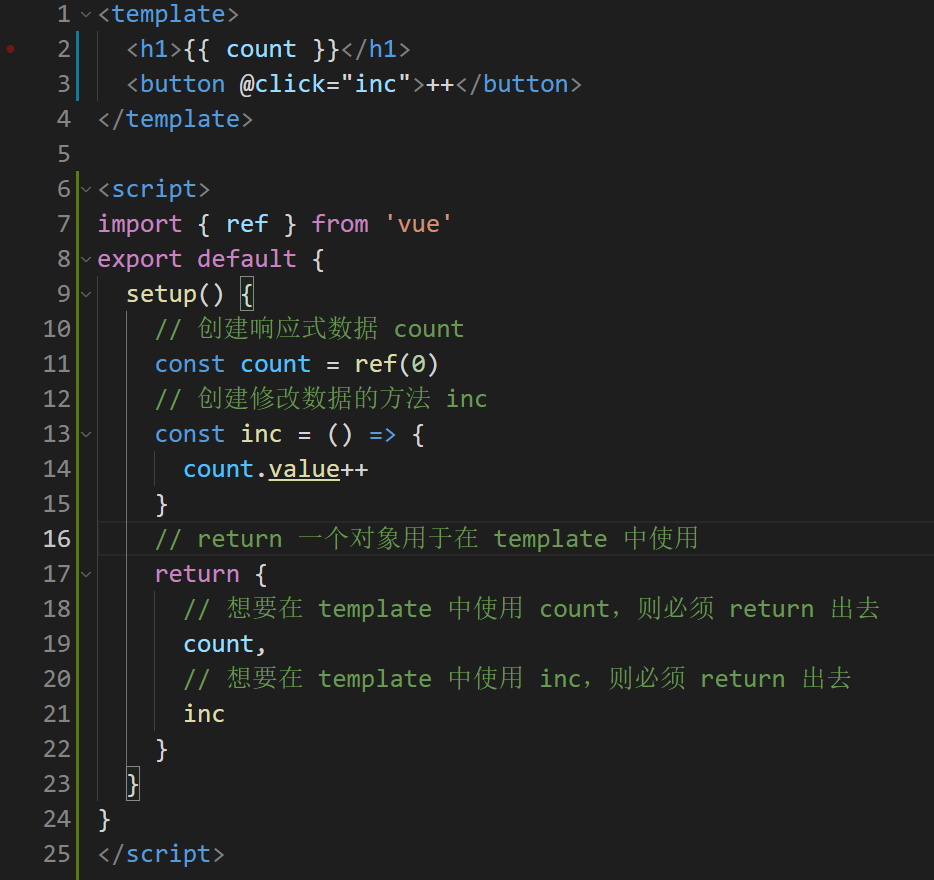
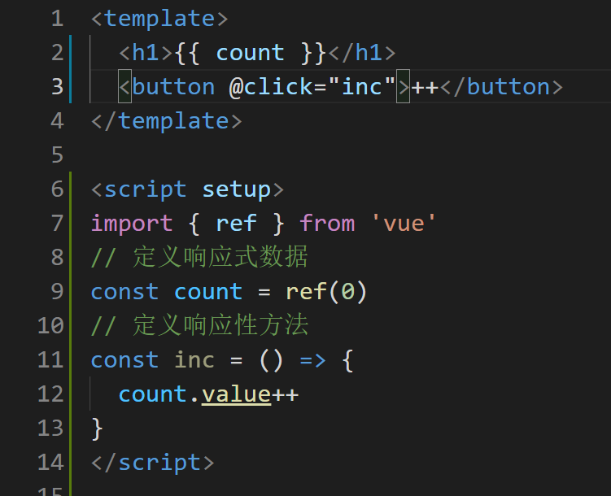

如果大家使用过 早期的 `composition API` ，那么应该会对 `setup 函数` 感触颇深，它的语法是反人类的。

所以在  `vue3` 正式发布 40天 之后， 也就是 `2020年10月28日` （`vue3` 正式发布日期为 `2020年9月18日`）提出了新的 [script  setup](https://github.com/vuejs/rfcs/blob/master/active-rfcs/0040-script-setup.md) 提案，该提案的目的只有一个：**那就是让大家可以更爽的使用 `composition API` 语法**！

该提案在 `2021年8月9日` 正式定稿，并伴随着最新的 `vue3` 版本进行了发布，这也是为什么前面我们需要升级到最新的 `vue` 版本的原因。

下面两张截图为对比 `原setup函数`  与   `script setup`：

1. `原 setup`函数

2、script setup

从截图中可以看出 `script setup` 语法更加符合我们开发者书写 `JS` 代码的习惯，它让我们书写 `vue` 就像再写普通的 `js` 一样。

所以以后的 `composition API` 将是 `script setup` 语法的时代，`原setup函数` 将会逐渐退出历史舞台。

而我们的项目也将会全部使用最新的 `script setup` 语法，让大家紧抓时代脉搏！