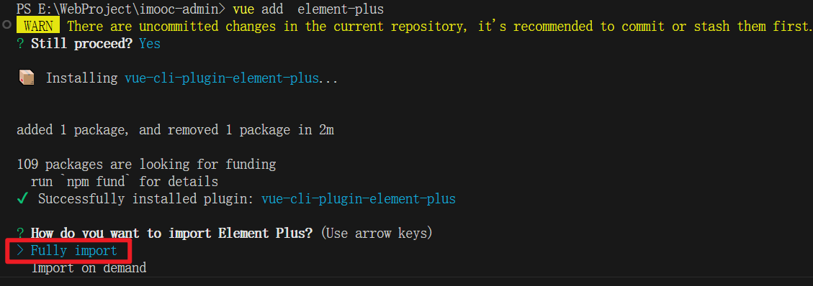
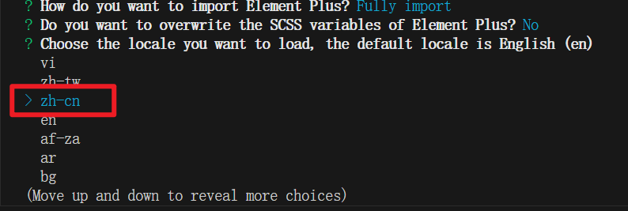
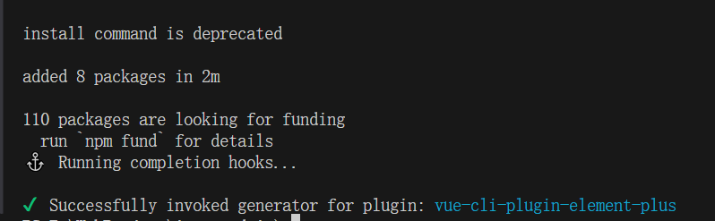

在开发我们的项目之前，我们需要先去导入 element-ui 的 vue3 支持版本，也就是 element-plus

element-plus 提供了快捷导入的方式，即：vue-cli-plugin-element-plus，大家可以通过以下方式来快捷导入 element-plus （注意：此种方 自动修改 App.vue 文件）： 

1、 在通过 vue-cli 创建的项目中，执行

```
vue add element-plus
```

2、选择全局导入



3、暂不生成覆盖变量的 scss 文件


4、选择简体中文即可



5、出现该提示表示安装完成

